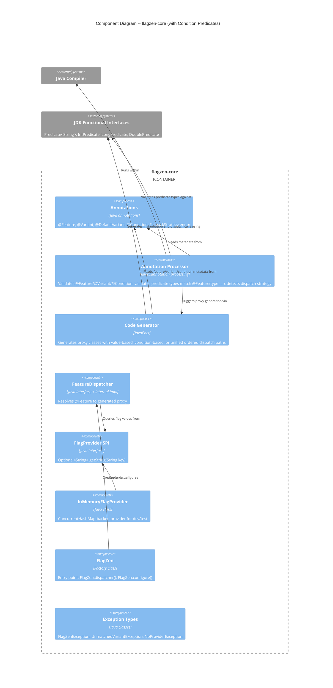

# Architecture Design -- Condition Predicates (flagzen-conditions)

## 1. Overview

This document describes how condition-based predicate dispatch integrates into the existing flagzen-core architecture. Condition predicates extend the dispatch model: in addition to matching a string flag value to a variant via exact match, the proxy can evaluate user-defined predicates against the flag value itself and delegate to the first matching variant.

All changes are additive to flagzen-core. No existing module boundaries change. No new Gradle submodules are introduced for the core condition feature (Spring DI extension is deferred to flagzen-spring when M4 is available).

### Dependencies

No dependency on M1 (EvaluationContext). Predicates test flag values directly using JDK functional interfaces (`Predicate<String>`, `IntPredicate`, `LongPredicate`, `DoublePredicate`), not EvaluationContext.

## 2. C4 System Context (Level 1)

No changes to the L1 diagram. Condition predicates are internal to the FlagZen library. No new external systems or actors are introduced.

## 3. C4 Container Diagram (Level 2)

No changes to the L2 diagram. All condition predicate types live in flagzen-core. No new Gradle submodules are created. The flagzen-spring module gains predicate DI support in a future milestone (US-CP-08), but that is an extension of the existing module, not a new container.

## 4. C4 Component Diagram (Level 3) -- flagzen-core with Condition Predicates

The L3 diagram extends the existing flagzen-core component diagram with new types and modified components.

## 5. Dispatch Architecture

### Unified Ordered Dispatch

Exact-match variants and condition-based variants coexist on the same `@Feature`. The `order` attribute on `@Variant` controls evaluation sequence:

|         Scenario          |                          Dispatch Strategy                           |
| ------------------------- | -------------------------------------------------------------------- |
| No `order` on any variant | Map-based O(1) lookup (value-based, identical to M0, no regression)  |
| `order` present           | Ordered list evaluation, first match wins (exact + conditions mixed) |

The processor does NOT reject mixing exact matches and conditions. Instead, `order` on `@Variant` determines evaluation sequence. This is a unified model, not mutually exclusive modes.

### Dispatch Flow (unified ordered)

For features with `order` specified on any variant, the generated proxy follows this dispatch flow on each method call:

1. Obtain the flag value from `FlagProvider.getString(key)`
2. If flag value is absent: delegate to `@DefaultVariant` or apply `FallbackStrategy`
3. For each entry in `order` sequence (ascending):
   - **Exact match entry**: compare flag value to entry's expected string; if equal, delegate and return
   - **Condition entry**: convert flag value to the feature's declared type, call `predicate.test(value)`; if true, delegate and return
4. First match wins -- short-circuit, remaining entries not evaluated
5. If no entry matched: delegate to `@DefaultVariant` or apply `FallbackStrategy`

### Dispatch Flow (value-based, no order)

When no variant specifies `order`, the proxy behaves identically to M0:

1. Query `FlagProvider.getString(key)` for the flag value
2. Look up the variant in the map (O(1))
3. If found: delegate; if not found: `@DefaultVariant` or `FallbackStrategy`

### Predicate Lifecycle

- Predicates are instantiated once at proxy construction time via no-arg constructor
- Predicate instances are stored as final fields in the generated proxy
- The same predicate instance is reused across all method calls (stateless contract)
- FlagZen does not catch exceptions from `predicate.test()` -- they propagate to the caller

### Predicate Type Matching

The processor validates that predicate types match the feature's declared type:

| `@Feature(type=...)` |      Required predicate interface      |
| -------------------- | -------------------------------------- |
| `STRING` (default)   | `java.util.function.Predicate<String>` |
| `INT`                | `java.util.function.IntPredicate`      |
| `LONG`               | `java.util.function.LongPredicate`     |
| `DOUBLE`             | `java.util.function.DoublePredicate`   |

## 6. Annotation Changes

### @Condition (new)

A nested annotation type used exclusively within `@Variant(when = ...)`.

|  Attribute   |    Type    |                                              Description                                              |
| ------------ | ---------- | ----------------------------------------------------------------------------------------------------- |
| `matches`    | `Class<?>` | The predicate class to evaluate. Must implement the JDK predicate type matching `@Feature(type=...)`. |
| `notMatches` | `Class<?>` | Negation predicate (mutually exclusive with `matches`). Same type constraints apply.                  |

Retention: `CLASS` (needed by annotation processor, not at runtime).

### @Variant (modified)

New `when` and `order` attributes added to `@Variant`:

| Attribute |     Type     |        Default        |                    Description                    |
| --------- | ------------ | --------------------- | ------------------------------------------------- |
| `value`   | `String`     | `""`                  | Variant value for value-based dispatch (existing) |
| `of`      | `Class<?>`   | `void.class`          | Target @Feature interface (existing)              |
| `when`    | `@Condition` | sentinel `@Condition` | Condition for predicate-based dispatch (new)      |
| `order`   | `int`        | `Integer.MAX_VALUE`   | Evaluation sequence, ascending (new)              |

The `when` attribute defaults to a sentinel `@Condition` whose `matches` attribute references a sentinel class. The processor detects the sentinel to distinguish "no condition specified" from a real condition.

**Backward compatibility**: Existing `@Variant("VALUE")` declarations compile and behave identically. The `when` attribute defaults to the sentinel, so the processor treats them as value-based. When no variant specifies `order`, the proxy uses map-based O(1) lookup -- zero performance regression.

### @Feature (unchanged)

No changes to `@Feature`. The `fallback` attribute works with both dispatch strategies. The `REQUIRED` strategy gains new semantics for condition-based features: it requires `@DefaultVariant` at compile time because predicate completeness cannot be statically verified.

## 7. Annotation Processor Changes

### Dispatch Strategy Detection

After collecting all variants for a `@Feature`, the processor checks whether any variant specifies `order`:

- **No order on any variant**: value-based map lookup (M0 behavior)
- **Order on any variant**: unified ordered dispatch (exact matches + conditions evaluated in sequence)

### Condition-Specific Validations

1. **Predicate type check**: `@Condition(matches = X.class)` -- verify `X` implements the JDK predicate interface matching `@Feature(type=...)` (e.g., `Predicate<String>` for STRING features, `IntPredicate` for INT features)
2. **Instantiability check**: verify `X` is not abstract and has an accessible no-arg constructor (via `ElementFilter.constructorsIn()`)
3. **Order uniqueness**: no two variants within the same `@Feature` share the same `order` value
4. **REQUIRED + conditions**: if `FallbackStrategy.REQUIRED` and feature has condition-based variants, require `@DefaultVariant` at compile time
5. **Mutual exclusivity**: `matches` and `notMatches` cannot both be specified on the same `@Condition`

### FeatureModel Extension

The processor's `FeatureModel` gains awareness of ordered dispatch. The `VariantModel` gains optional condition metadata and an order field. These changes are processor-internal and do not affect the public API.

## 8. Proxy Generation Changes

### Proxy Structure by Strategy

|       Aspect       |              Value-based (no order)              |                          Unified ordered dispatch                          |
| ------------------ | ------------------------------------------------ | -------------------------------------------------------------------------- |
| Constructor params | `FlagProvider`, variant map, default variant     | `FlagProvider`, ordered entries, default variant                           |
| Fields             | `flagProvider`, `variants` map, `defaultVariant` | `flagProvider`, ordered entry array, `defaultVariant`                      |
| Resolve method     | Query FlagProvider, map lookup                   | Query FlagProvider, iterate entries (exact match or predicate), first wins |
| FlagProvider       | Used on every call                               | Used on every call (flag value needed for both exact match and predicate)  |

### Generated Code Properties

- Zero `java.lang.reflect` imports (existing constraint maintained)
- Predicates instantiated via `new Enterprise()` (compile-time generated, not reflective)
- Predicate instances and entry arrays are `final` fields
- Thread-safe: immutable proxy, predicates are user-responsibility for thread safety
- Predicate class names follow standard naming (no "Is" prefix convention imposed)

## 9. Fallback Behavior

Condition-based features reuse the existing `FallbackStrategy` enum with adapted semantics:

|  Strategy   |            Value-based (M0)            |                                 With conditions                                  |
| ----------- | -------------------------------------- | -------------------------------------------------------------------------------- |
| `REQUIRED`  | Enum coverage verified at compile time | `@DefaultVariant` required at compile time (predicate completeness unverifiable) |
| `EXCEPTION` | `UnmatchedVariantException` at runtime | `UnmatchedVariantException` at runtime (message includes predicate list)         |
| `NOOP`      | Returns safe defaults                  | Returns safe defaults (same behavior)                                            |

When no flag value is available:

- If `@DefaultVariant` exists: use it
- If no `@DefaultVariant`: apply `FallbackStrategy`

## 10. Spring DI Extension (US-CP-08 -- Deferred)

When flagzen-spring is available, `@Component`-annotated predicates are resolved from the Spring `ApplicationContext` instead of via no-arg constructor. This requires:

- A `PredicateFactory` abstraction (or equivalent) injected into the proxy at construction time
- The annotation processor relaxing the no-arg constructor check when the class bears `@Component` (or `@Service`, `@Repository`, etc.)
- Mixed predicates within a single `@Feature`: some Spring-managed, some plain

This is deferred until M4 (flagzen-spring) is available. It extends flagzen-spring, not flagzen-core.

## 11. Thread Safety

|          Component          |                                                     Strategy                                                     |
| --------------------------- | ---------------------------------------------------------------------------------------------------------------- |
| Generated proxies (ordered) | Immutable after construction. Entry array and variant instances are `final`.                                     |
| Predicate instances         | User responsibility. FlagZen documents that predicates must be thread-safe if the application is multi-threaded. |

## 12. Quality Attribute Impact

### Maintainability (PRIMARY)

- Unified model: exact matches and conditions coexist using `order` on `@Variant` -- developers learn one model
- Condition logic is isolated in user-defined predicate classes implementing JDK functional interfaces -- no FlagZen-specific interface to learn
- Processor validations catch configuration errors at compile time, reducing runtime debugging

### Testability (PRIMARY)

- Predicates implement standard JDK interfaces -- unit-testable in isolation with simple values
- Generated proxies are concrete classes -- debuggable and inspectable
- `@PinFlag`/`TestFlagContext` from flagzen-test continue to work for value-based features
- Condition-based features testable by providing flag values and calling methods directly

### Performance (SECONDARY)

- When no `order` specified: map-based O(1) lookup, identical to M0. Zero regression for existing users.
- When `order` specified: linear scan through ordered entries (typically 2-5 entries)
- No reflection, no dynamic dispatch
- Predicates instantiated once, reused per call -- zero allocation overhead per dispatch
- **Compile-time guardrail**: Processor short-circuits condition validation for features without `@Condition`. Projects not using conditions incur negligible (<1%) additional compile time.

### Reliability (SECONDARY)

- Compile-time validation catches: invalid predicate types, type mismatches, missing no-arg constructors, duplicate orders, missing `@DefaultVariant` for REQUIRED
- Exception propagation from predicates is explicit (no silent swallowing)
- `@DefaultVariant` provides a safety net for unmatched conditions

## 13. Architectural Enforcement

Existing ArchUnit rules apply unchanged. One additional rule recommended:

|                   Rule                    |   Tool   |          Enforcement          |
| ----------------------------------------- | -------- | ----------------------------- |
| No `java.lang.reflect` in flagzen-core    | ArchUnit | Existing rule covers new code |
| `com.flagzen.internal` classes not public | ArchUnit | Existing rule covers new code |
| No cycles in `com.flagzen.(*)..` slices   | ArchUnit | Existing rule covers new code |

## 14. ADR Index

|                                  ADR                                  |                            Title                             |  Status  |
| --------------------------------------------------------------------- | ------------------------------------------------------------ | -------- |
| [ADR-008](../../../adrs/ADR-008-mutually-exclusive-dispatch-modes.md) | Unified Ordered Dispatch (replaces Mutually Exclusive Modes) | Accepted |
| [ADR-009](../../../adrs/ADR-009-predicate-instantiation-strategy.md)  | Predicate Instantiation Strategy                             | Accepted |
| [ADR-010](../../../adrs/ADR-010-condition-annotation-nesting.md)      | @Condition Annotation Nesting in @Variant                    | Accepted |
