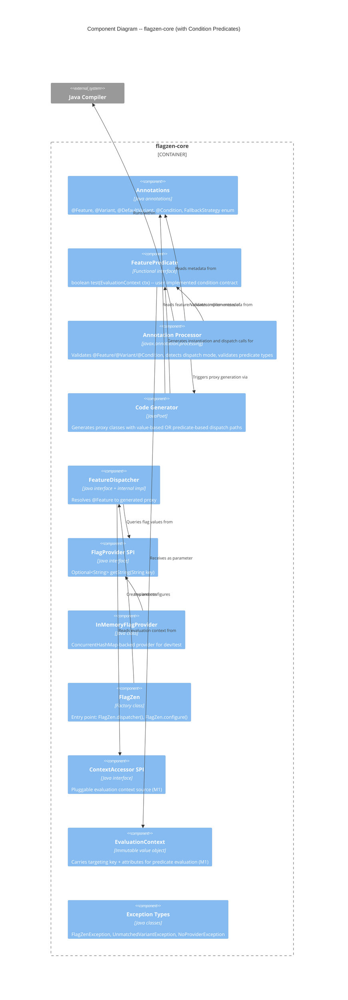

# Architecture Design -- Condition Predicates (flagzen-conditions)

## 1. Overview

This document describes how condition-based predicate dispatch integrates into the existing flagzen-core architecture. Condition predicates add a second dispatch mode: instead of matching a string flag value to a variant, the proxy evaluates user-defined predicates against an `EvaluationContext` and delegates to the first matching variant.

All changes are additive to flagzen-core. No existing module boundaries change. No new Gradle submodules are introduced for the core condition feature (Spring DI extension is deferred to flagzen-spring when M4 is available).

### Dependency

This milestone (M6) depends on M1 (EvaluationContext). The `FeaturePredicate.test()` method takes `EvaluationContext` as its parameter. M1 must be completed before M6 implementation begins.

## 2. C4 System Context (Level 1)

No changes to the L1 diagram. Condition predicates are internal to the FlagZen library. No new external systems or actors are introduced.

## 3. C4 Container Diagram (Level 2)

No changes to the L2 diagram. All condition predicate types live in flagzen-core. No new Gradle submodules are created. The flagzen-spring module gains predicate DI support in a future milestone (US-CP-08), but that is an extension of the existing module, not a new container.

## 4. C4 Component Diagram (Level 3) -- flagzen-core with Condition Predicates

The L3 diagram extends the existing flagzen-core component diagram with new types and modified components.

## 5. Dispatch Mode Architecture

### Two Dispatch Modes

A `@Feature` interface uses exactly one dispatch mode, determined at compile time by the annotation processor:

|           Mode           |                          Trigger                           |                       Dispatch Logic                        |
| ------------------------ | ---------------------------------------------------------- | ----------------------------------------------------------- |
| **Value-based** (M0)     | `@Variant("VALUE")` -- `value` attribute set, no `when`    | Query FlagProvider for string value, look up variant in map |
| **Condition-based** (M6) | `@Variant(when = @Condition(...))` -- `when` attribute set | Evaluate predicates in order, delegate to first match       |

The modes are mutually exclusive per `@Feature`. The processor rejects any `@Feature` that mixes both modes. `@DefaultVariant` is compatible with both modes.

### Predicate Dispatch Flow

For condition-based features, the generated proxy follows this dispatch flow on each method call:

1. Obtain `EvaluationContext` from the resolution chain (explicit parameter > ContextAccessor > scoped > default)
2. If no `EvaluationContext` is available, fall through to `@DefaultVariant` or `FallbackStrategy`
3. Iterate predicates in `order` sequence (ascending)
4. Call `predicate.test(ctx)` on each
5. First predicate returning `true` selects its associated variant -- short-circuit, remaining predicates not evaluated
6. If no predicate matches, fall through to `@DefaultVariant` or `FallbackStrategy`

### Predicate Lifecycle

- Predicates are instantiated once at proxy construction time via no-arg constructor
- Predicate instances are stored as final fields in the generated proxy
- The same predicate instance is reused across all method calls (stateless contract)
- FlagZen does not catch exceptions from `predicate.test()` -- they propagate to the caller

## 6. Annotation Changes

### @Condition (new)

A nested annotation type used exclusively within `@Variant(when = ...)`.

| Attribute |                Type                 |                             Description                              |
| --------- | ----------------------------------- | -------------------------------------------------------------------- |
| `on`      | `Class<? extends FeaturePredicate>` | The predicate class to evaluate                                      |
| `order`   | `int`                               | Evaluation sequence (ascending). Must be unique within the @Feature. |

Retention: `CLASS` (needed by annotation processor, not at runtime).

### @Variant (modified)

A new `when` attribute is added to `@Variant`:

| Attribute |     Type     |        Default        |                    Description                    |
| --------- | ------------ | --------------------- | ------------------------------------------------- |
| `value`   | `String`     | `""`                  | Variant value for value-based dispatch (existing) |
| `of`      | `Class<?>`   | `void.class`          | Target @Feature interface (existing)              |
| `when`    | `@Condition` | sentinel `@Condition` | Condition for predicate-based dispatch (new)      |

The `when` attribute defaults to a sentinel `@Condition` whose `on` attribute references a sentinel class (e.g., `FeaturePredicate.None.class` or a package-private `NoCondition.class`). The processor detects the sentinel to distinguish "no condition specified" from a real condition.

**Backward compatibility**: Existing `@Variant("VALUE")` declarations compile and behave identically. The `when` attribute defaults to the sentinel, so the processor treats them as value-based.

### @Feature (unchanged)

No changes to `@Feature`. The `fallback` attribute works with both dispatch modes. The `REQUIRED` strategy gains new semantics for condition-based features: it requires `@DefaultVariant` at compile time because predicate completeness cannot be statically verified.

## 7. Annotation Processor Changes

### Dispatch Mode Detection

After collecting all variants for a `@Feature`, the processor partitions them:

- **Value-based variants**: `when` is sentinel AND `value` is non-empty
- **Condition-based variants**: `when` is not sentinel

If both partitions are non-empty, the processor emits a compile error: `"Feature \"{flagKey}\" mixes value-based and condition-based variants. Each feature must use one dispatch mode."`

### Condition-Specific Validations

1. **Predicate type check**: `@Condition(on = X.class)` -- verify `X` implements `FeaturePredicate` using `Types.isAssignable()`
2. **Instantiability check**: verify `X` is not abstract and has an accessible no-arg constructor (via `ElementFilter.constructorsIn()`)
3. **Order uniqueness**: no two condition variants within the same `@Feature` share the same `order` value
4. **REQUIRED + conditions**: if `FallbackStrategy.REQUIRED` and feature is condition-based, require `@DefaultVariant` at compile time

### FeatureModel Extension

The processor's `FeatureModel` gains awareness of dispatch mode. The `VariantModel` gains optional condition metadata. These changes are processor-internal and do not affect the public API.

## 8. Proxy Generation Changes

### Condition-Based Proxy Structure

For condition-based features, the generated proxy differs from value-based proxies:

|       Aspect       |                   Value-based (M0)                   |                           Condition-based (M6)                           |
| ------------------ | ---------------------------------------------------- | ------------------------------------------------------------------------ |
| Constructor params | `FlagProvider`, variant map, default variant         | Condition-variant pairs (sorted by order), default variant               |
| Fields             | `flagProvider`, `variants` map, `defaultVariant`     | `FeaturePredicate[]` + corresponding variant instances, `defaultVariant` |
| Resolve method     | Query FlagProvider, map lookup                       | Iterate predicates, call `test(ctx)`, return first match                 |
| EvaluationContext  | Not used in dispatch (may be passed to FlagProvider) | Required for predicate evaluation                                        |
| FlagProvider       | Used on every call                                   | Not used (predicates replace flag lookup)                                |

### Generated Code Properties

- Zero `java.lang.reflect` imports (existing constraint maintained)
- Predicates instantiated via `new IsEnterprise()` (compile-time generated, not reflective)
- Predicate array and variant instances are `final` fields
- Thread-safe: immutable proxy, predicates are user-responsibility for thread safety

### EvaluationContext Resolution in Proxy

The generated proxy obtains `EvaluationContext` using the same resolution chain as M1:

1. Explicit parameter (if the dispatch method supports it -- future extension)
2. `ContextAccessor` SPI (ServiceLoader-discovered, priority-ordered)
3. Scoped context (e.g., `FlagContext.run()` thread-local)
4. Default context (from `FlagZenConfiguration`)
5. No context available: skip all predicates, fall through to default/fallback

## 9. Fallback Behavior for Conditions

Condition-based features reuse the existing `FallbackStrategy` enum with adapted semantics:

|  Strategy   |            Value-based (M0)            |                               Condition-based (M6)                               |
| ----------- | -------------------------------------- | -------------------------------------------------------------------------------- |
| `REQUIRED`  | Enum coverage verified at compile time | `@DefaultVariant` required at compile time (predicate completeness unverifiable) |
| `EXCEPTION` | `UnmatchedVariantException` at runtime | `UnmatchedVariantException` at runtime (message includes predicate list)         |
| `NOOP`      | Returns safe defaults                  | Returns safe defaults (same behavior)                                            |

When no `EvaluationContext` is available and the feature is condition-based:

- If `@DefaultVariant` exists: use it
- If no `@DefaultVariant`: apply `FallbackStrategy`

## 10. Spring DI Extension (US-CP-08 -- Deferred)

When flagzen-spring is available, `@Component`-annotated predicates are resolved from the Spring `ApplicationContext` instead of via no-arg constructor. This requires:

- A `PredicateFactory` abstraction (or equivalent) injected into the proxy at construction time
- The annotation processor relaxing the no-arg constructor check when the class bears `@Component` (or `@Service`, `@Repository`, etc.)
- Mixed predicates within a single `@Feature`: some Spring-managed, some plain

This is deferred until M4 (flagzen-spring) is available. It extends flagzen-spring, not flagzen-core.

## 11. Thread Safety

|             Component             |                                                     Strategy                                                     |
| --------------------------------- | ---------------------------------------------------------------------------------------------------------------- |
| Generated condition-based proxies | Immutable after construction. Predicate array and variant instances are `final`.                                 |
| FeaturePredicate instances        | User responsibility. FlagZen documents that predicates must be thread-safe if the application is multi-threaded. |
| EvaluationContext                 | Immutable (M1 design). Safe to pass to predicates from any thread.                                               |

## 12. Quality Attribute Impact

### Maintainability (PRIMARY)

- Two dispatch modes share the same `@Feature`/`@Variant` annotation surface -- developers learn one model
- Condition logic is isolated in user-defined `FeaturePredicate` classes -- clean separation of concerns
- Processor validations catch configuration errors at compile time, reducing runtime debugging

### Testability (PRIMARY)

- `FeaturePredicate` is a simple interface -- unit-testable in isolation with constructed `EvaluationContext`
- Generated proxies are concrete classes -- debuggable and inspectable
- `@PinFlag`/`TestFlagContext` from flagzen-test continue to work for value-based features
- Condition-based features testable by constructing `EvaluationContext` and calling methods directly

### Performance (SECONDARY)

- Predicate dispatch is a linear scan through an ordered array (typically 2-5 predicates)
- No reflection, no map lookups for conditions
- Predicates instantiated once, reused per call -- zero allocation overhead per dispatch
- Performance of individual predicates is user responsibility (documented best practice: sub-millisecond)
- **Compile-time guardrail**: Processor short-circuits condition validation for value-based features. Projects not using `@Condition` incur negligible (<1%) additional compile time. The guardrail from outcome KPIs (compile time must not increase by more than 10% for non-condition projects) is satisfied by design: the processor only enters condition validation paths when `@Variant.when` carries a non-sentinel `@Condition`.

### Reliability (SECONDARY)

- Compile-time validation catches: invalid predicate types, missing no-arg constructors, duplicate orders, mixed dispatch modes, missing `@DefaultVariant` for REQUIRED
- Exception propagation from predicates is explicit (no silent swallowing)
- `@DefaultVariant` provides a safety net for unmatched conditions

## 13. Architectural Enforcement

Existing ArchUnit rules apply unchanged. One additional rule recommended:

|                                    Rule                                    |   Tool   |                                                           Enforcement                                                           |
| -------------------------------------------------------------------------- | -------- | ------------------------------------------------------------------------------------------------------------------------------- |
| No `java.lang.reflect` in flagzen-core                                     | ArchUnit | Existing rule covers new code                                                                                                   |
| `com.flagzen.internal` classes not public                                  | ArchUnit | Existing rule covers new code                                                                                                   |
| No cycles in `com.flagzen.(*)..` slices                                    | ArchUnit | Existing rule covers new code                                                                                                   |
| `FeaturePredicate` implementations must not import `com.flagzen.processor` | ArchUnit | `noClasses().that().implement(FeaturePredicate.class).should().accessClassesThat().resideInAPackage("com.flagzen.processor..")` |

## 14. ADR Index

|                                  ADR                                  |                   Title                   |  Status  |
| --------------------------------------------------------------------- | ----------------------------------------- | -------- |
| [ADR-008](../../../adrs/ADR-008-mutually-exclusive-dispatch-modes.md) | Mutually Exclusive Dispatch Modes         | Accepted |
| [ADR-009](../../../adrs/ADR-009-predicate-instantiation-strategy.md)  | Predicate Instantiation Strategy          | Accepted |
| [ADR-010](../../../adrs/ADR-010-condition-annotation-nesting.md)      | @Condition Annotation Nesting in @Variant | Accepted |
