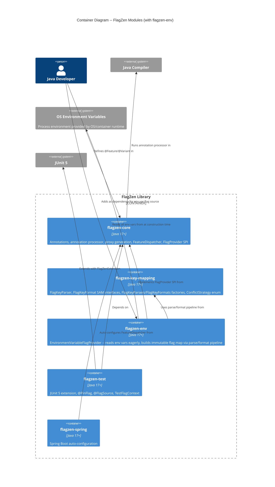
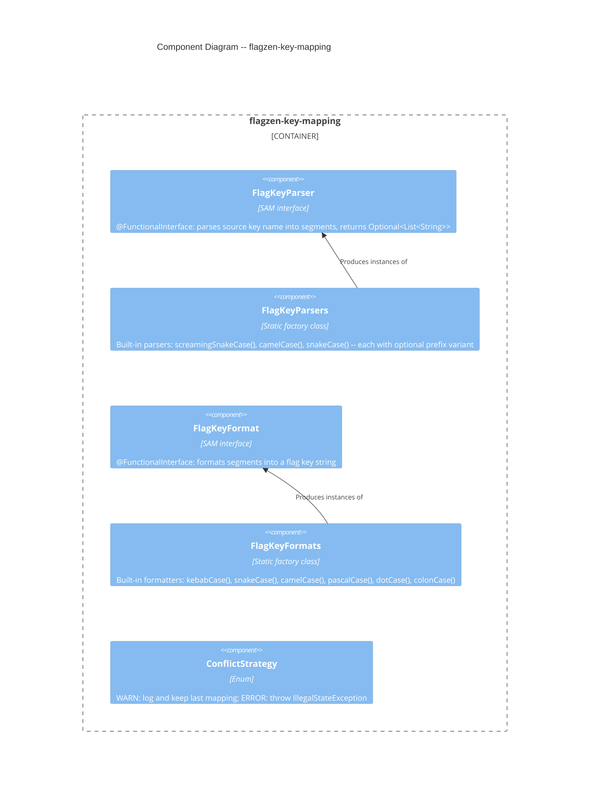
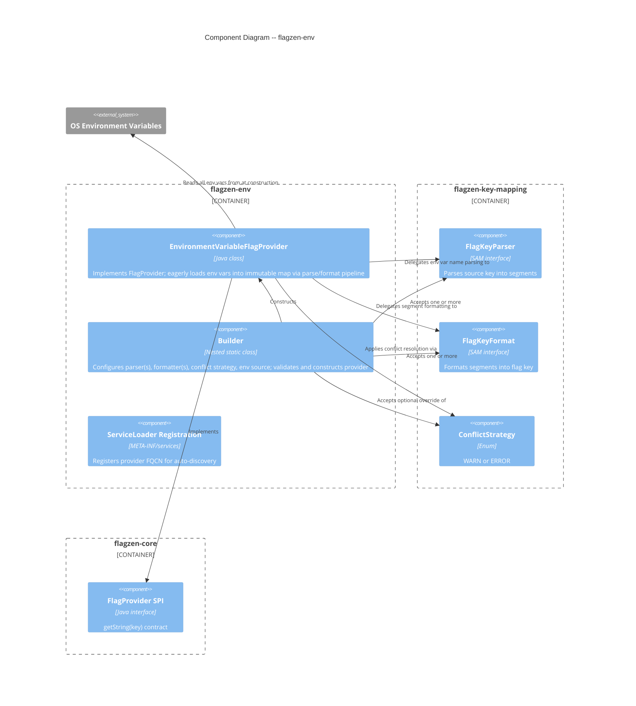

# Architecture Design -- flagzen-env (Environment Variable Provider)

## 1. Overview

This design covers two new Gradle submodules delivering environment-variable-based flag resolution with reusable key-mapping infrastructure:

| Module | Responsibility | Package |
| --- | --- | --- |
| `flagzen-key-mapping` | Reusable parse/format pipeline for converting source system key names to flag keys | `com.flagzen.keymapping` |
| `flagzen-env` | `FlagProvider` SPI implementation that reads environment variables eagerly into an immutable map | `com.flagzen.env` |

### Quality Attribute Priorities

| Attribute | Priority | Strategy |
| --- | --- | --- |
| Testability | PRIMARY | `Supplier<Map<String, String>>` injection for `System.getenv()` isolation; SAM interfaces enable lambda-based testing |
| Performance | PRIMARY | Eager loading at construction; `getString()` is O(1) map lookup; zero runtime I/O |
| Extensibility | PRIMARY | Key-mapping infrastructure reusable by future providers (file, vault, consul) |
| Maintainability | SECONDARY | Separate modules with single responsibility; dependency inversion via SAM interfaces |
| Reliability | SECONDARY | Immutable map is inherently thread-safe; conflict detection prevents silent data loss |

## 2. C4 System Context (Level 1)

No change to the existing L1 diagram. `flagzen-env` is an internal module of the FlagZen library; the "Flag Source" external system (already in the M0 L1 diagram) encompasses environment variables.

## 3. C4 Container Diagram (Level 2) -- Updated Module Architecture

This diagram extends the M0 container diagram with the two new modules.



`flagzen-key-mapping` is self-contained with zero dependencies (not even `flagzen-core`). See Section 6 for the dependency graph.

## 4. C4 Component Diagram (Level 3) -- flagzen-key-mapping



## 5. C4 Component Diagram (Level 3) -- flagzen-env



## 6. Module Dependency Graph

```
flagzen-core (zero external dependencies)
  ^
  | --- flagzen-key-mapping (zero external dependencies, no dep on flagzen-core)
  |       ^
  |       | --- flagzen-env (depends on: flagzen-core, flagzen-key-mapping)
  |
  | --- flagzen-test (depends on: flagzen-core, junit-jupiter-api)
  | --- flagzen-spring (depends on: flagzen-core, spring-boot-autoconfigure)
  | ... (other modules unchanged)
```

Key dependency decisions:

- **flagzen-key-mapping has NO dependency on flagzen-core.** The SAM interfaces, factory classes, and `ConflictStrategy` enum are self-contained. This maximizes reusability -- any project can use key mapping without FlagZen.
- **flagzen-env depends on both flagzen-core and flagzen-key-mapping.** It implements `FlagProvider` (from core) and uses the parse/format pipeline (from key-mapping).
- **Developers add only `flagzen-env`.** Gradle pulls `flagzen-key-mapping` and `flagzen-core` transitively.

## 7. Eager Loading Pipeline

The construction-time pipeline transforms environment variables into an immutable flag map:

```
Step 1: Read environment
  System.getenv() -> Map<String, String> (all env vars, read once)

Step 2: Parse each env var name through each parser
  For each (envVarName, envVarValue) in environment:
    For each parser in parsers:
      parser.parse(envVarName) -> Optional<List<String>>
      If present: (segments, envVarValue, envVarName) -> candidate pool

Step 3: Format segments through each formatter
  For each (segments, envVarValue, envVarName) in candidate pool:
    For each formatter in formatters:
      formatter.format(segments) -> flagKey
      (flagKey, envVarValue, envVarName) -> mapping pool

Step 4: Conflict detection on mapping pool
  For each (flagKey, envVarValue, envVarName) in mapping pool:
    If flagKey already mapped:
      Apply ConflictStrategy:
        WARN: log warning with both env var names + flag key, keep last mapping,
              record flagKey in conflicted-keys set
        ERROR: throw IllegalStateException with both env var names + flag key

Step 5: Freeze
  Map.copyOf(flagMap) -> immutable flag map
  Set.copyOf(conflictedKeys) -> immutable conflicted-keys set (for first-access warning)

Step 6: Runtime
  getString(key) -> flagMap.get(key) wrapped in Optional
  First access of conflicted key: log warning once, mark as warned
```

### Thread Safety

- **Immutable flag map**: constructed once, never modified. Thread-safe by construction.
- **Conflicted-keys tracking**: the set of conflicted keys is immutable after construction. The "already warned" tracking for first-access warnings requires a concurrent set (to track which conflicted keys have had their warning logged). This is the only mutable state after construction.

## 8. Conflict Detection Algorithm

### Default Strategy Selection (Cardinality Rules)

| Parsers | Formatters | Default Strategy | Rationale |
| --- | --- | --- | --- |
| 1 | 1 | WARN | Conflicts only from env var collisions (rare). Low risk. |
| N | 1 | WARN | Multiple parsers may match same env var name differently, but single formatter limits blast radius. Warn on override. |
| 1 | N | WARN | Single parser means each env var parsed once, but multiple formatters produce multiple keys per env var. Conflicts from different env vars formatting to same key. Warn on override. |
| N | N | ERROR | Cartesian explosion: N parsers x M formatters = high conflict probability. Fail fast by default. Can be overridden to WARN. |

### Conflict Definition

A conflict occurs when two different (envVarName, envVarValue) pairs produce the same flagKey. Two scenarios:

1. **Same env var, different parsers**: env var `CHECKOUT_FLOW` matched by both `screamingSnakeCase()` and `snakeCase()` parsers, both producing segments `["checkout", "flow"]`, which format to the same key. Same value, no real conflict -- but logged as WARN since the mapping is redundant.
2. **Different env vars, same flag key**: `FLAGZEN_CHECKOUT_FLOW=PREMIUM` and `myAppCheckoutFlow=BASIC` both map to `checkout-flow`. Different values -- genuine conflict.

### Warning on First Access

When `ConflictStrategy.WARN` is active and a conflict was detected during construction:

1. The conflicted flag key is recorded in an immutable set.
2. On the first `getString(conflictedKey)` call, a warning is logged: "Flag key 'checkout-flow' had a conflict during construction. Env var 'myAppCheckoutFlow' overrode 'FLAGZEN_CHECKOUT_FLOW'."
3. Subsequent calls to `getString(conflictedKey)` produce no warning.
4. Non-conflicted keys never trigger warnings.

## 9. Integration with flagzen-core

### FlagProvider SPI Contract

`EnvironmentVariableFlagProvider` implements `FlagProvider`:

- `getString(String key)`: returns `Optional.ofNullable(immutableMap.get(key))`
- `getString(String key, EvaluationContext context)`: delegates to `getString(key)` -- env vars are static, context is ignored (uses `FlagProvider` default)
- All typed methods (`getBoolean`, `getInt`, `getLong`, `getDouble`): use `FlagProvider` default implementations that parse from `getString()`

### ServiceLoader Discovery

- File: `flagzen-env/src/main/resources/META-INF/services/com.flagzen.spi.FlagProvider`
- Content: `com.flagzen.env.EnvironmentVariableFlagProvider`
- The ServiceLoader-discovered instance uses `create()` (default configuration)
- Requires a public no-arg constructor that delegates to `create()` internally

### Transitive Dependencies

When a developer adds `com.flagzen:flagzen-env`, Gradle resolves:
- `com.flagzen:flagzen-key-mapping` (transitive)
- `com.flagzen:flagzen-core` (transitive)

## 10. Builder API Design

```
EnvironmentVariableFlagProvider.builder()
  .parser(FlagKeyParser)              // replaces default parser; can be called multiple times
  .formatter(FlagKeyFormat)           // replaces default formatter; can be called multiple times
  .onConflict(ConflictStrategy)       // overrides cardinality-based default
  .environmentSource(Supplier<Map<String, String>>)  // for testability; defaults to System::getenv
  .build()                            // validates, runs pipeline, returns immutable provider
```

### Builder Behavior

- **No parser set**: defaults to `FlagKeyParsers.screamingSnakeCase("FLAGZEN_")`
- **No formatter set**: defaults to `FlagKeyFormats.kebabCase()`
- **No conflict strategy set**: computed from cardinality rules (see Section 8)
- **Multiple `.parser()` calls**: accumulates parsers in order
- **Multiple `.formatter()` calls**: accumulates formatters in order
- **`.build()` is where all work happens**: reads env vars, runs pipeline, detects conflicts, freezes map
- **Null arguments**: rejected with `NullPointerException` on builder methods (fail-fast)

### Factory Method

`EnvironmentVariableFlagProvider.create()` is sugar for `builder().build()` with all defaults.

## 11. Quality Attribute Strategies

### Testability

- `Supplier<Map<String, String>>` injection on builder enables tests to provide controlled environment maps without mocking `System.getenv()`
- `FlagKeyParser` and `FlagKeyFormat` are `@FunctionalInterface` SAMs -- trivially testable with lambda assertions
- `ConflictStrategy` behavior tested via builder with known-conflicting inputs

### Performance

- Eager loading: single `System.getenv()` call at construction
- Immutable map: `getString()` is `Map.get()` -- O(1), no allocation, no synchronization
- No lazy initialization, no caching layers, no runtime I/O

### Extensibility

- `flagzen-key-mapping` is provider-agnostic -- future `flagzen-file`, `flagzen-vault`, `flagzen-consul` modules reuse the same parse/format pipeline
- Custom parsers and formatters via lambda (SAM interfaces)
- `ConflictStrategy` is reusable for any provider that maps from external key names

### Reliability

- Immutable state after construction -- no race conditions, no stale reads
- Conflict detection catches ambiguous mappings at construction time
- `ERROR` strategy fails fast for dangerous configurations (N x N)

## 12. Gradle Module Setup

### flagzen-key-mapping/build.gradle.kts

```
plugins {
    `java-library`
}

// No dependencies on flagzen-core or any external library
// Zero external dependencies
```

### flagzen-env/build.gradle.kts

```
plugins {
    `java-library`
}

dependencies {
    api(project(":flagzen-key-mapping"))    // transitive to consumers
    implementation(project(":flagzen-core")) // FlagProvider SPI
}
```

### settings.gradle.kts additions

```
include("flagzen-key-mapping")
include("flagzen-env")
```

## 13. Architectural Enforcement

| Rule | Tool | Enforcement |
| --- | --- | --- |
| `flagzen-key-mapping` has zero dependencies | Gradle dependency constraints | `build.gradle.kts` -- no `dependencies {}` block beyond test scope |
| `flagzen-env` depends only on `flagzen-core` and `flagzen-key-mapping` | Gradle dependency constraints | Explicit in `build.gradle.kts` |
| No `java.lang.reflect` in either module | ArchUnit | `noClasses().that().resideInAPackage("com.flagzen.keymapping..").or().resideInAPackage("com.flagzen.env..").should().accessClassesThat().resideInAPackage("java.lang.reflect")` |
| Package structure compliance | ArchUnit | `com.flagzen.keymapping` for key-mapping, `com.flagzen.env` for provider |
| Internal classes not public | ArchUnit | Builder is a public nested class; no other public classes beyond the documented API surface |
| `FlagProvider` thread-safety contract | Documentation + code review | Immutable map guarantees thread safety |

## 14. External Integrations

Neither `flagzen-key-mapping` nor `flagzen-env` integrates with external third-party services. The only external boundary is `System.getenv()`, which is a JDK API -- no contract testing needed.

## 15. ADR Index

| ADR | Title | Status |
| --- | --- | --- |
| [ADR-015](../../../adrs/ADR-015-key-mapping-module-split.md) | Key Mapping Module Split | Accepted |
| [ADR-016](../../../adrs/ADR-016-eager-loading-strategy.md) | Eager Loading Strategy | Accepted |
| [ADR-017](../../../adrs/ADR-017-conflict-strategy-design.md) | Conflict Strategy Design | Accepted |

## 16. Handoff Notes for acceptance-designer

### Stories to Component Mapping

| Story | Module | Component |
| --- | --- | --- |
| US-ENV-01 | flagzen-env | EnvironmentVariableFlagProvider, create() |
| US-ENV-02 | flagzen-env | EnvironmentVariableFlagProvider (eager loading, immutable map) |
| US-ENV-03 | flagzen-env | ServiceLoader registration |
| US-ENV-04 | flagzen-env | Builder (custom parser, custom formatter) |
| US-ENV-05 | flagzen-key-mapping | FlagKeyParser, FlagKeyParsers |
| US-ENV-06 | flagzen-key-mapping | FlagKeyFormat, FlagKeyFormats |
| US-ENV-07 | flagzen-env | Builder (multiple parsers) |
| US-ENV-08 | flagzen-env | Builder (multiple formatters) |
| US-ENV-09 | flagzen-key-mapping | ConflictStrategy |
| US-ENV-10 | flagzen-env | First-access warning |

### Development Paradigm

OOP (Java 17+). Dependency inversion via SAM interfaces (ports-and-adapters pattern).
