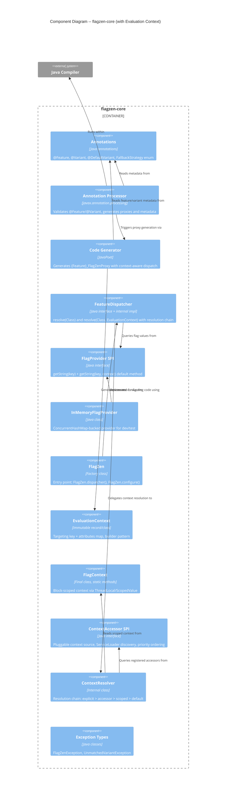

# Architecture Design -- Evaluation Context (flagzen-eval-context)

## 1. Overview

This document describes how evaluation context support integrates into the existing flagzen-core architecture. It covers new types, modified contracts, generated code changes, and the context resolution chain. All changes are within flagzen-core; no new modules are introduced.

### Scope

- EvaluationContext immutable model with builder
- FlagProvider SPI evolution (backward-compatible default method)
- FeatureDispatcher API evolution (resolve overload)
- Generated proxy context forwarding
- FlagContext block-scoped context (ThreadLocal, ScopedValue R2)
- ContextAccessor SPI definition
- Deterministic resolution order

### Relationship to Existing Architecture

This milestone extends flagzen-core only. The module dependency graph (architecture-design.md Section 5) is unchanged. No new modules, no new external dependencies. All new types live in existing packages (`com.flagzen`, `com.flagzen.spi`, `com.flagzen.internal`).

## 2. C4 System Context (Level 1) -- Unchanged

The system context diagram from the M0 architecture document remains valid. No new external actors or systems are introduced.

## 3. C4 Container Diagram (Level 2) -- Unchanged

The module architecture is unchanged. All evaluation context types are within flagzen-core. Provider adapter modules (LaunchDarkly, OpenFeature, etc.) will optionally override `FlagProvider.getString(key, context)` in their own modules, but that is a downstream concern per adapter milestone.

## 4. C4 Component Diagram (Level 3) -- flagzen-core Updated

The L3 diagram adds new components for evaluation context support.



## 5. Context Resolution Chain

The resolution chain is the core architectural addition. It determines which EvaluationContext is used when `FeatureDispatcher.resolve()` is called.

### Resolution Order (Fixed, Not Configurable)

```
1. Explicit parameter    -- resolve(Class<T>, EvaluationContext)
2. ContextAccessor SPI   -- first non-empty result, sorted by priority (lower = higher)
3. Block-scoped context  -- FlagContext.run() ThreadLocal/ScopedValue
4. Default context       -- FlagZen.configure(config -> config.defaultContext(...))
5. No context            -- falls back to getString(key) without context (M0 behavior)
```

### Resolution Flow

```
resolve(Class<T> featureType)
  |
  v
resolve(Class<T> featureType, EvaluationContext explicitCtx = null)
  |
  v
ContextResolver.resolve(explicitCtx)
  | -- explicitCtx != null? --> use it                                    |
  | -- ContextAccessor (sorted by priority) returns non-empty? --> use it |
  | -- FlagContext.current() != null? --> use it                          |
  | -- defaultContext != null? --> use it                                 |
  | -- none? --> null (no context)                                        |
  |                                                                       |
  v
context == null?
  | -- yes --> proxy.resolveVariant() calls flagProvider.getString(key)         |
  | -- no  --> proxy.resolveVariant(ctx) calls flagProvider.getString(key, ctx) |
```

### Design Rationale

The order follows the principle of specificity: the most specific context (explicit parameter) wins over the most general (default). This matches configuration precedence conventions in Java (programmatic > property > env > default). See ADR-011.

## 6. Generated Proxy Evolution

### Current (M0)

Generated proxies call `flagProvider.getString(flagKey)` in their `resolveVariant()` method.

### Updated (M1)

Generated proxies gain:

1. A new field to hold the current EvaluationContext (set per-resolution, not per-construction)
2. A `resolveVariant(EvaluationContext)` method that calls `flagProvider.getString(flagKey, context)` when context is present
3. The existing `resolveVariant()` method (no-arg) is retained for backward compatibility, calling `flagProvider.getString(flagKey)`

### Context Injection Path

The proxy does not discover context itself. The `DefaultFeatureDispatcher` resolves the context via `ContextResolver` and passes it to the proxy at resolution time. The proxy is context-agnostic -- it receives context or null and dispatches accordingly.

This means the proxy constructor signature and caching strategy must evolve:

- **M0**: Proxies are singletons, cached in `ConcurrentHashMap`. The proxy is stateless (queries FlagProvider per method call).
- **M1**: Proxies remain singletons. Context is not stored on the proxy. Instead, the proxy's dispatch methods receive context as a parameter from the caller (the dispatcher). The generated proxy methods call `flagProvider.getString(key, context)` where context is resolved by the dispatcher and threaded through.

The critical design choice: **context flows through the proxy's method dispatch, not through proxy construction or proxy state**. The proxy remains stateless and cacheable.

### Implementation Approach (for crafter)

The proxy needs to receive context at dispatch time. Two options exist:

1. **Thread-local context**: The dispatcher sets context in a thread-local before proxy method invocation, proxy reads it. (Couples proxy to FlagContext internals.)
2. **Context-aware proxy internal method**: The generated `resolveVariant()` reads context from `FlagContext.current()` (the same ThreadLocal/ScopedValue used by `FlagContext.run()`). The dispatcher sets the resolved context into `FlagContext` before returning the proxy, and the proxy reads it on each method call.

Option 2 is cleaner: the dispatcher resolves context and stores it in `FlagContext.current()`, and the generated proxy reads from `FlagContext.current()` on each `resolveVariant()` call. This means:

- `resolve(Class<T>)` resolves context via the chain and stores it in `FlagContext`
- `resolve(Class<T>, EvaluationContext)` stores the explicit context in `FlagContext`
- Generated proxy calls `FlagContext.current()` in `resolveVariant()` and branches to `getString(key, ctx)` or `getString(key)` accordingly

The crafter decides the final internal design. This document specifies the behavioral contract.

## 7. FlagProvider SPI Evolution

### Backward Compatibility

`FlagProvider.getString(String key, EvaluationContext context)` is added as a **default method** that delegates to `getString(key)`. This ensures:

- All existing `FlagProvider` implementations compile and work without changes
- Context-aware providers override the method to use context
- The SPI contract remains a single-method core (`getString(key)`) with an optional extension

### Provider Adapter Responsibility

Each provider adapter module (LaunchDarkly, OpenFeature, Togglz) maps `EvaluationContext` to their provider-specific context model. This mapping is per-adapter, out of scope for this milestone.

## 8. FlagContext Block-Scoped Context

### Design

`FlagContext` is a final class with static methods. It is not instantiated.

- `FlagContext.run(EvaluationContext, Runnable)` -- scopes context to a block
- `FlagContext.run(EvaluationContext, Supplier<T>)` -- scopes context and returns result
- `FlagContext.current()` -- returns the current scoped context (or null)

### Nesting

Nested `FlagContext.run()` calls override the context for the duration of the inner block. On exit (normal or exceptional), the previous context is restored.

### Carrier Strategy (R1 vs R2)

- **Release 1**: ThreadLocal carrier. Correct on all Java 17+ runtimes including virtual threads (ThreadLocal is inherited by virtual threads).
- **Release 2**: ScopedValue carrier on Java 21+ with ThreadLocal fallback. Detection at class-loading time via reflective check for `java.lang.ScopedValue` class availability. See ADR-012.

## 9. ContextAccessor SPI

### Contract

```
Interface: com.flagzen.spi.ContextAccessor
Methods:
  - Optional<EvaluationContext> getContext()
  - int priority()  // lower number = higher priority
Discovery: java.util.ServiceLoader via META-INF/services/com.flagzen.spi.ContextAccessor
```

### Discovery and Caching

ContextAccessors are discovered once during `DefaultFeatureDispatcher` construction (not per-resolve). They are sorted by priority and stored as an immutable list. On each resolve call, the list is iterated until a non-empty result is found.

### Priority Convention

|  Range  |              Purpose              |
| ------- | --------------------------------- |
| 0-99    | Framework-level (Reactor, Mutiny) |
| 100-199 | Application-level                 |
| 200+    | Fallback                          |

### No Implementations in This Milestone

The SPI is defined here. Implementations (`ReactorContextAccessor`, `MutinyContextAccessor`) belong to M6 (flagzen-reactor, flagzen-mutiny).

## 10. FlagZen Configuration Evolution

`FlagZen.FlagZenConfiguration` gains:

- `defaultContext(EvaluationContext)` -- sets the default context (resolution level 4)

The configuration object is passed to `DefaultFeatureDispatcher`, which uses it to construct the `ContextResolver`.

## 11. FeatureDispatcher Evolution

`FeatureDispatcher` interface gains:

- `<T> T resolve(Class<T> featureType, EvaluationContext context)` -- resolve with explicit context

The existing `resolve(Class<T>)` remains. The new method is added to the interface directly (not as a default method) since `FeatureDispatcher` is a FlagZen-owned interface, not a user-implemented SPI. Custom implementations must add the overload.

**Counterargument considered**: Adding a default method that delegates to `resolve(Class<T>)` would preserve backward compatibility for any custom `FeatureDispatcher` implementations. However, since `FeatureDispatcher` is created exclusively via `FlagZen.dispatcher()` and is not designed for user extension, this is unnecessary. If a user has a custom implementation, a compile error is a correct signal that they must handle context.

## 12. Thread Safety

|     Component     |                                Strategy                                 |
| ----------------- | ----------------------------------------------------------------------- |
| EvaluationContext | Immutable. Thread-safe by design.                                       |
| FlagContext       | ThreadLocal/ScopedValue per-thread isolation. Thread-safe by design.    |
| ContextAccessor   | Implementations must be thread-safe (documented contract).              |
| ContextResolver   | Stateless (reads from immutable accessor list + FlagContext). Safe.     |
| Generated proxies | Stateless dispatch. Context flows through FlagContext, not proxy state. |

## 13. Quality Attribute Impact

### Maintainability

- EvaluationContext is immutable with builder -- simple, predictable lifecycle
- Resolution chain is a linear pipeline with clear precedence -- easy to reason about
- FlagProvider evolution via default method -- zero impact on existing providers

### Testability

- Each resolution level is independently testable
- FlagContext.run() enables test-scoped context without DI
- InMemoryFlagProvider continues to work (ignores context via default method)
- @PinFlag and TestFlagContext are unaffected

### Performance

- Context resolution adds one traversal of the accessor list (typically 0-2 entries) + one ThreadLocal read per resolve call
- EvaluationContext is immutable -- no defensive copying needed
- Zero additional reflection

### Backward Compatibility

- `resolve(Class<T>)` unchanged
- `FlagProvider.getString(key)` unchanged
- `InMemoryFlagProvider` compiles unchanged
- Existing generated proxies work after recompilation

## 14. Story-to-Component Traceability

|  Story   |                            Components Modified/Created                             |
| -------- | ---------------------------------------------------------------------------------- |
| US-EC-01 | EvaluationContext (new, `com.flagzen`)                                             |
| US-EC-02 | FeatureDispatcher (modified), DefaultFeatureDispatcher (modified)                  |
| US-EC-03 | FlagProvider (modified -- default method added)                                    |
| US-EC-04 | ProxyGenerator (modified -- context-aware dispatch generation)                     |
| US-EC-05 | FlagContext (new, `com.flagzen`)                                                   |
| US-EC-06 | ContextAccessor (new, `com.flagzen.spi`)                                           |
| US-EC-07 | ContextResolver (new, `com.flagzen.internal`), DefaultFeatureDispatcher (modified) |
| US-EC-08 | FlagContext (modified -- ScopedValue carrier, R2)                                  |

## 15. ADR Index (This Milestone)

|   ADR   |                           Title                           |  Status  |
| ------- | --------------------------------------------------------- | -------- |
| ADR-011 | Context Resolution Order                                  | Accepted |
| ADR-012 | FlagContext Carrier Strategy (ThreadLocal vs ScopedValue) | Accepted |

## 16. Architectural Enforcement

Existing ArchUnit rules remain. Additional enforcement for this milestone:

|                         Rule                          |     Tool      |                            Enforcement                             |
| ----------------------------------------------------- | ------------- | ------------------------------------------------------------------ |
| EvaluationContext has no setters                      | ArchUnit      | `classes().that().haveSimpleName("EvaluationContext").should()...` |
| FlagContext is final with no public constructors      | ArchUnit      | Class structure validation                                         |
| No `java.lang.reflect` in `com.flagzen..` (unchanged) | ArchUnit      | Existing rule covers new classes                                   |
| ContextAccessor implementations are thread-safe       | Documentation | Documented in Javadoc contract                                     |
