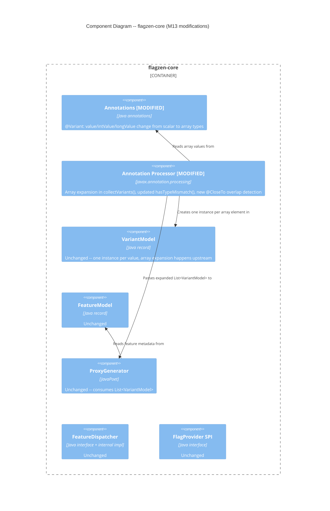

# Architecture Design -- flagzen-multi-value-variant (M13)

## 1. Change Summary

This feature modifies the `@Variant` annotation schema and annotation processor within `flagzen-core` to support mapping multiple flag values to a single variant implementation via array syntax. No new modules, no new runtime components, no new dependencies.

### Scope

| Area | Impact |
| --- | --- |
| `@Variant` annotation | Element types change from scalar to array (string, int, long) |
| `FlagZenProcessor` | Array expansion in `collectVariants()`, updated `hasTypeMismatch()`, new `@CloseTo` overlap validation |
| `VariantModel` | No structural change -- one instance per value (array expansion produces multiple instances) |
| `ProxyGenerator` | No change -- already consumes `List<VariantModel>` |
| Generated proxies | No change -- variant map already supports multiple keys to same `Supplier` |
| Runtime dispatch | No change |

### What does NOT change

- `FeatureModel`, `ProxyGenerator`, generated proxy structure, `FeatureDispatcher`, `FlagProvider` SPI, any module outside `flagzen-core`
- `doubleValue` element type (`CloseTo[]` already supports arrays)
- `booleanValue` element (only two possible values; multi-value is meaningless)

## 2. C4 System Context (Level 1)

No change from M0 architecture. This feature is internal to `flagzen-core`; no new external actors or systems.

## 3. C4 Container Diagram (Level 2)

No change from M0 architecture. All modifications are within the `flagzen-core` container.

## 4. C4 Component Diagram (Level 3) -- Modified Components

This diagram highlights which components within `flagzen-core` are modified (annotated with `[MODIFIED]`) versus unchanged.



## 5. Annotation Schema Migration

### Before (M2 / current)

```
@Variant {
    String   value()       default "";
    int      intValue()    default Integer.MIN_VALUE;
    long     longValue()   default Long.MIN_VALUE;
    CloseTo[] doubleValue() default {};
    String   booleanValue() default "";
    Class<?> of()          default void.class;
}
```

### After (M13)

```
@Variant {
    String[] value()        default "";          // String auto-wraps to {""}
    int[]    intValue()     default {};           // empty array = not set
    long[]   longValue()    default {};           // empty array = not set
    CloseTo[] doubleValue() default {};           // no change
    String   booleanValue() default "";           // no change
    Class<?> of()           default void.class;   // no change
}
```

### Source Compatibility

| Existing usage | After change | Behavior |
| --- | --- | --- |
| `@Variant(value = "X")` | Single string auto-wraps to `{"X"}` | Source compatible |
| `@Variant(intValue = 42)` | Single int auto-wraps to `{42}` | Source compatible |
| `@Variant(longValue = 999L)` | Single long auto-wraps to `{999L}` | Source compatible |
| `@Variant(doubleValue = @CloseTo(...))` | Already array | No change |
| `@Variant(booleanValue = "true")` | Not changed | No change |

**Binary compatibility**: broken. Acceptable pre-1.0 per wave-decisions.md.

## 6. Processor Modifications

### 6.1 `collectVariants()` / `processVariantAnnotation()` -- Array Expansion

Current behavior: reads a single scalar value per annotation element and creates one `VariantModel`.

New behavior: reads the array, iterates each element, creates one `VariantModel` per element. All instances share the same `qualifiedClassName`. This is the key change -- all downstream validation and code generation operates on the flat `List<VariantModel>` and requires no modification.

**Type-specific expansion logic:**

| Type | Current sentinel | New "not set" check | Expansion |
| --- | --- | --- | --- |
| STRING | `""` (empty string) | Array contains only `""` (default) | Skip `""` entries, create `VariantModel` per non-empty string |
| INT | `Integer.MIN_VALUE` | `length == 0` | Create `VariantModel` per element; `Integer.MIN_VALUE` is now a valid value |
| LONG | `Long.MIN_VALUE` | `length == 0` | Create `VariantModel` per element; `Long.MIN_VALUE` is now a valid value |
| DOUBLE | `length == 0` | `length == 0` (no change) | Already iterates array; extend to create one `VariantModel` per `@CloseTo` entry |

### 6.2 `hasTypeMismatch()` -- Sentinel Check Update

Current: `annotation.intValue() != Integer.MIN_VALUE` and `annotation.longValue() != Long.MIN_VALUE`.

New: `annotation.intValue().length > 0` and `annotation.longValue().length > 0`.

The `hasString` check changes from `!annotation.value().isEmpty()` to checking whether the array has any non-empty-string element (to distinguish the default `{""}` from user-specified values).

### 6.3 `hasDuplicateVariantValues()` -- No Structural Change

Already groups by `variantKeyLiteral()` and detects duplicates. Since array expansion produces multiple `VariantModel` entries with the same `qualifiedClassName` but different values, the existing grouping-by-key logic naturally catches:

- Cross-class duplicates (two classes claim same value)
- Intra-array duplicates (same value repeated in one array, producing two `VariantModel` with same key and same class)
- Cross-syntax duplicates (array value matches a repeated annotation value)

### 6.4 New Validation: `@CloseTo` Overlap Detection

New validation method to detect overlapping `@CloseTo` ranges. Two checks:

1. **Intra-variant**: within a single variant class's `doubleValue` array, pairwise compare all `@CloseTo` entries. Overlap condition: `|v1 - v2| < d1 + d2`.
2. **Inter-variant**: across all variant classes for the same DOUBLE-typed feature, pairwise compare all `@CloseTo` entries. Same overlap formula.

Error messages include: variant class names, computed ranges `[value - delta, value + delta]`, and remediation suggestion.

### 6.5 Empty String in Array Validation

When the `value()` array contains an empty string alongside real values (e.g., `{"CLASSIC", ""}`), the processor emits a compile error. Empty string is only valid as the sole default element.

## 7. Existing Validation -- Natural Compatibility

These existing validations work unchanged because they operate on the flat `List<VariantModel>` produced after array expansion:

| Validation | Why it works |
| --- | --- |
| `validateVariantValuesAgainstEnum()` | Iterates `VariantModel` list, checks each `variantValue()` against enum |
| `hasIncompleteVariantCoverage()` | Collects covered values from `VariantModel.variantValue()` into a `Set` |
| `hasDuplicateVariantValues()` | Groups by `variantKeyLiteral()` -- more entries, same logic |

## 8. Quality Attribute Impact

| Attribute | Impact | Rationale |
| --- | --- | --- |
| Maintainability | Positive | Array expansion is a single upstream change; all downstream logic unchanged |
| Testability | Neutral | Same test patterns; more scenarios (array combinations) but same tooling |
| Performance | Negligible | Array iteration at compile time only; runtime dispatch unchanged |
| Reliability | Positive | Unreserves `Integer.MIN_VALUE` / `Long.MIN_VALUE` as valid values; adds `@CloseTo` overlap detection |
| Backward compatibility | Source-compatible, binary-incompatible | Acceptable pre-1.0 |

## 9. Risk Assessment

| Risk | Likelihood | Impact | Mitigation |
| --- | --- | --- | --- |
| `String[] value() default ""` default behavior | Medium | High | Processor must treat `{""}` as "no value specified", same as current `""` sentinel |
| Floating-point precision in `@CloseTo` overlap | Low | Medium | Use `Math.abs(v1 - v2) < d1 + d2` with `Double.compare` for edge cases |
| Existing tests break from annotation schema change | Low | High | Source-compatible change; existing single-value usage auto-wraps; run full test suite |

## 10. Architectural Enforcement

Existing ArchUnit rules from M0 architecture remain applicable. No new enforcement rules needed for M13 -- this is an internal modification within an established component boundary.

| Rule | Tool | Status |
| --- | --- | --- |
| No `java.lang.reflect` in flagzen-core | ArchUnit | Unchanged -- no reflection introduced |
| No cross-extension dependencies | Gradle constraints | Unchanged -- M13 is core-only |
| Package structure compliance | ArchUnit | Unchanged |

## 11. ADR Index (M13)

| ADR | Title | Status |
| --- | --- | --- |
| [ADR-018](../../../adrs/ADR-018-variant-array-migration-strategy.md) | Variant Annotation Array Migration Strategy | Proposed |

## 12. Handoff Notes

### To acceptance-designer (DISTILL wave)

- 7 user stories with BDD scenarios in `docs/feature/flagzen-multi-value-variant/discuss/user-stories.md`
- Journey feature file in `docs/feature/flagzen-multi-value-variant/discuss/journey-multi-value-variant.feature`
- All acceptance criteria are behavioral (WHAT), not implementation-coupled (HOW)

### To software-crafter (GREEN wave)

- Walking skeleton: `String[] value()` change + `collectVariants()` array expansion + existing test suite passes
- Key insight: array expansion in `processVariantAnnotation()` is the single point of change; everything downstream operates on `List<VariantModel>` unchanged
- `@CloseTo` overlap detection is new validation logic, not a modification of existing validation
