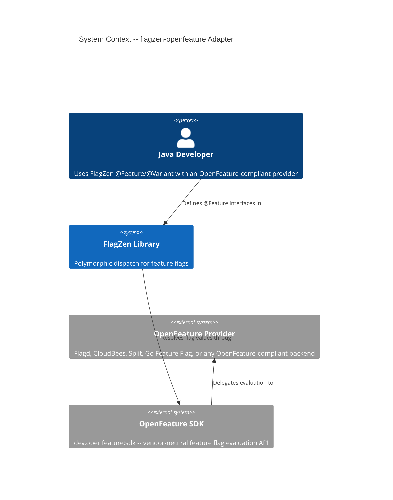
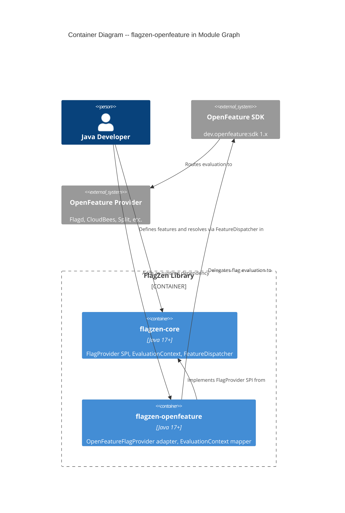

# Architecture Design -- flagzen-openfeature

## 1. System Context

The `flagzen-openfeature` module is a **driven adapter** in FlagZen's ports-and-adapters architecture. It bridges the `FlagProvider` SPI (the port) to the OpenFeature SDK (the external system). This module enables Java developers already using OpenFeature-compliant providers (Flagd, CloudBees, Split, Go Feature Flag) to adopt FlagZen's polymorphic dispatch without replacing their flag infrastructure.

### Capabilities

|       Capability        |                                          Description                                           |
| ----------------------- | ---------------------------------------------------------------------------------------------- |
| String flag resolution  | Delegates `getString` to `Client.getStringDetails` with reason-based absence detection         |
| Native typed resolution | Delegates `getBoolean`, `getInt`, `getLong`, `getDouble` to OpenFeature's typed detail methods |
| Context mapping         | Converts `com.flagzen.EvaluationContext` to `dev.openfeature.sdk.EvaluationContext`            |
| Auto-discovery          | ServiceLoader registration via `META-INF/services/com.flagzen.spi.FlagProvider`                |
| Dual construction       | No-arg (global client) and parameterized (explicit client) constructors                        |

### Constraints

- Must implement the full `FlagProvider` SPI contract (10 methods)
- Zero runtime reflection (project-wide constraint)
- OpenFeature SDK has no `getLongDetails` -- `getLong` must use `getIntegerDetails` with widening
- The `reason` field in `FlagEvaluationDetails` is the primary signal for "absent flag" detection

## 2. C4 System Context (Level 1)



## 3. C4 Container Diagram (Level 2)



## 4. Context Mapping Strategy

This adapter sits at the boundary between two SPIs: FlagZen's `FlagProvider` and OpenFeature's `Client`. The context mapping relationship is **Conformist** on the OpenFeature side -- we conform to the OpenFeature SDK's API without introducing an anti-corruption layer, because the OpenFeature SDK is itself a vendor-neutral abstraction (it is already the ACL for the underlying provider).

### Mapping Direction

```
FlagZen domain                    OpenFeature domain
---------------------------       ---------------------------
FlagProvider.getString(key)  -->  Client.getStringDetails(key, default)
FlagProvider.getBoolean(key) -->  Client.getBooleanDetails(key, default)
FlagProvider.getInt(key)     -->  Client.getIntegerDetails(key, default)
FlagProvider.getLong(key)    -->  Client.getIntegerDetails(key, default) + widening
FlagProvider.getDouble(key)  -->  Client.getDoubleDetails(key, default)
EvaluationContext            -->  dev.openfeature.sdk.EvaluationContext
| Optional.empty()             <--  reason=DEFAULT         | errorCode set |       |      |
| Optional.of(value)           <--  reason=TARGETING_MATCH | STATIC        | SPLIT | etc. |
```

## 5. OpenFeature SDK API Usage

### Detail Methods

The adapter uses OpenFeature's `*Details` methods exclusively (not the simpler `get*` methods) because only the detail response includes the `reason` field needed for absent-flag detection.

| FlagProvider method |    OpenFeature Client method    | Default sentinel |           Return mapping            |
| ------------------- | ------------------------------- | ---------------- | ----------------------------------- |
| `getString(key)`    | `getStringDetails(key, "")`     | `""`             | reason-based                        |
| `getBoolean(key)`   | `getBooleanDetails(key, false)` | `false`          | reason-based                        |
| `getInt(key)`       | `getIntegerDetails(key, 0)`     | `0`              | reason-based                        |
| `getLong(key)`      | `getIntegerDetails(key, 0)`     | `0`              | reason-based, widen `int` to `long` |
| `getDouble(key)`    | `getDoubleDetails(key, 0.0)`    | `0.0`            | reason-based                        |

### Reason-Based Absence Detection

OpenFeature's `FlagEvaluationDetails.getReason()` returns a string. The adapter treats a resolution as **absent** (returning empty) when:

1. `errorCode` is non-null (evaluation error occurred)
2. `reason` equals `"DEFAULT"` (no provider configured, or flag not found -- the SDK returned the client-supplied default without real resolution)

All other reason values (`TARGETING_MATCH`, `STATIC`, `SPLIT`, `DISABLED`, `CACHED`, `UNKNOWN`, or any custom reason) indicate a real resolution occurred, and the adapter returns the resolved value.

This is the core design decision -- see ADR-020 for full analysis.

### Long Type Limitation

OpenFeature SDK provides `getIntegerDetails` (returns `Integer`) but no `getLongDetails`. The adapter:

1. Calls `client.getIntegerDetails(key, 0)`
2. Widens the `Integer` result to `long` via implicit conversion

This is safe for values within `Integer.MIN_VALUE` to `Integer.MAX_VALUE`. Values outside this range cannot be represented through OpenFeature's integer API. This is a known limitation of the OpenFeature SDK, not something the adapter can work around.

## 6. Dependency Graph

```
flagzen-openfeature
  +-- flagzen-core (same version, compile dependency)
  +-- dev.openfeature:sdk (1.x, compile dependency, Apache 2.0)
```

No transitive dependency on any specific OpenFeature provider. The developer supplies the provider at runtime (e.g., `dev.openfeature.contrib.providers:flagd`).

## 7. Technology Stack

|    Component    |       Technology        |       Version       |     License     |                  Rationale                   |
| --------------- | ----------------------- | ------------------- | --------------- | -------------------------------------------- |
| Language        | Java                    | 17+                 | N/A             | Project standard                             |
| Build           | Gradle (Kotlin DSL)     | Project version     | Apache 2.0      | Project standard                             |
| Core dependency | flagzen-core            | Same version        | Project license | SPI contract                                 |
| External SDK    | dev.openfeature:sdk     | 1.x (latest stable) | Apache 2.0      | Only OpenFeature SDK option; CNCF project    |
| Logging         | java.util.logging (JUL) | JDK                 | N/A             | Consistent with flagzen-env; zero added deps |

### Why `dev.openfeature:sdk`

This is the only implementation of the OpenFeature specification for Java. There are no alternatives to evaluate. The SDK is a CNCF Incubating project with active maintenance, Apache 2.0 license, and the standard that OpenFeature providers conform to.

## 8. Quality Attribute Strategies

### Testability (PRIMARY)

- `OpenFeatureFlagProvider` accepts a `Client` via constructor -- tests supply a mock `Client` without needing a real OpenFeature provider
- Context mapper is a pure function (FlagZen context in, OpenFeature context out) -- directly unit-testable
- The reason-based absence detection logic is deterministic and testable with controlled `FlagEvaluationDetails` responses

### Maintainability (PRIMARY)

- Single responsibility: one class implements `FlagProvider`, one mapper handles context conversion
- Conforms to OpenFeature SDK API without wrapping -- SDK version upgrades are localized to this module
- No cross-module coupling (depends only on flagzen-core)

### Reliability (SECONDARY)

- Error codes from OpenFeature map to `Optional.empty()` -- FlagZen's fallback strategy handles downstream
- No exceptions propagated from the adapter for evaluation failures (swallowed into empty)
- Thread safety inherited from OpenFeature `Client` (thread-safe per spec)

### Performance (SECONDARY)

- Native typed delegation avoids string-to-type-to-string round-tripping
- Context mapping is allocation-light (single `EvaluationContext.Builder` per call)
- No caching layer -- OpenFeature SDK and its providers handle caching internally

## 9. Integration Patterns

### ServiceLoader Auto-Discovery

`META-INF/services/com.flagzen.spi.FlagProvider` contains the FQCN `com.flagzen.openfeature.OpenFeatureFlagProvider`. The no-arg constructor calls `OpenFeatureAPI.getInstance().getClient()` to obtain the global client.

### Programmatic Construction

```
// Factory method with explicit client
OpenFeatureFlagProvider.create(myClient)

// No-arg for global client (also used by ServiceLoader)
new OpenFeatureFlagProvider()
```

### Gradle Module Registration

`settings.gradle.kts` must include `flagzen-openfeature`. The module's `build.gradle.kts` declares:

- `api(project(":flagzen-core"))`
- `implementation("dev.openfeature:sdk:$openFeatureVersion")`

## 10. External Integration

**External Integration Requiring Contract Tests:**

- **OpenFeature SDK** (Java SDK API): `flagzen-openfeature` consumes `Client.getStringDetails`, `Client.getBooleanDetails`, `Client.getIntegerDetails`, `Client.getDoubleDetails`, and `FlagEvaluationDetails` (reason, errorCode, value fields).
  Recommended: consumer-driven contracts via Pact or Spring Cloud Contract in CI acceptance stage to detect breaking changes in the OpenFeature SDK before production.

The OpenFeature SDK is a CNCF project with semver guarantees, but major version bumps (1.x to 2.x) could change the `Client` or `FlagEvaluationDetails` API surface.

## 11. Architectural Enforcement

|                       Rule                        |             Tool              |                                                              Enforcement                                                              |
| ------------------------------------------------- | ----------------------------- | ------------------------------------------------------------------------------------------------------------------------------------- |
| No `java.lang.reflect` in flagzen-openfeature     | ArchUnit                      | `noClasses().that().resideInAPackage("com.flagzen.openfeature..").should().accessClassesThat().resideInAPackage("java.lang.reflect")` |
| Depends only on flagzen-core (no cross-extension) | Gradle dependency constraints | `build.gradle.kts` -- verify no dependency on flagzen-env, flagzen-spring, etc.                                                       |
| Package structure: `com.flagzen.openfeature` only | ArchUnit                      | `classes().that().resideInAPackage("com.flagzen.openfeature..").should().onlyDependOnClassesThat()` match allowed packages            |

## 12. ADR Index

|                                ADR                                 |                           Title                           |  Status  |
| ------------------------------------------------------------------ | --------------------------------------------------------- | -------- |
| [ADR-020](../../../adrs/ADR-020-absent-flag-detection-strategy.md) | Absent Flag Detection Strategy (Reason-Based vs Sentinel) | Proposed |
