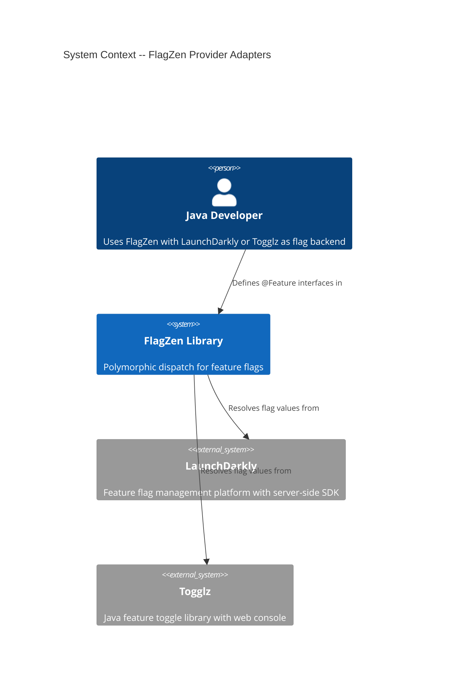
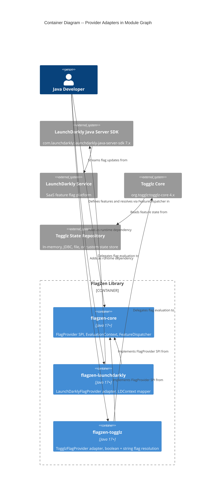

# Architecture Design -- flagzen-providers (LaunchDarkly + Togglz)

## 1. System Context

The `flagzen-launchdarkly` and `flagzen-togglz` modules are **driven adapters** in FlagZen's ports-and-adapters architecture, following the same pattern established by `flagzen-openfeature`. Each bridges the `FlagProvider` SPI (the port) to its respective external SDK.

Both adapters follow the design decisions from `flagzen-openfeature` (ADR-020, wave-decisions D1-D8) unless provider-specific differences force a divergence. Divergences are documented in ADRs and the wave-decisions for this feature.

### Adapter Capability Matrix

| FlagProvider method | OpenFeature | LaunchDarkly | Togglz |
| --- | --- | --- | --- |
| `getString(key)` | Native | Native | Via activation strategy parameter |
| `getString(key, ctx)` | Native | Native | Via activation strategy parameter (context ignored -- see D-T2) |
| `getBoolean(key)` | Native | Native | Native (`isActive`) |
| `getBoolean(key, ctx)` | Native | Native | Native (via `UserProvider` thread-local, not direct) |
| `getInt(key)` | Native | Native | String parse (default impl) |
| `getInt(key, ctx)` | Native | Native | String parse (default impl) |
| `getLong(key)` | Via int widen | Via JSON value | String parse (default impl) |
| `getLong(key, ctx)` | Via int widen | Via JSON value | String parse (default impl) |
| `getDouble(key)` | Native | Native | String parse (default impl) |
| `getDouble(key, ctx)` | Native | Native | String parse (default impl) |

### Key Differences from OpenFeature Adapter

1. **LaunchDarkly**: Has richer typed API than OpenFeature (native `int`, `double`, `jsonValue`). Long values are supported natively via `jsonValueVariationDetail`. Context model (`LDContext`) is more structured than OpenFeature's flat map.

2. **Togglz**: Primarily a boolean toggle system. Only `getBoolean` and `getString` have meaningful provider-specific implementations. All numeric types fall back to the `FlagProvider` default implementations (string parsing). Togglz's context model (`FeatureUser`) uses a thread-local `UserProvider` pattern that does not map to FlagZen's explicit `EvaluationContext` parameter passing.

## 2. C4 System Context (Level 1)



## 3. C4 Container Diagram (Level 2)



---

## 4. LaunchDarkly Adapter Design

### 4.1 SDK API Surface Used

The LaunchDarkly Java Server SDK v7.x provides `LDClient` with typed `*VariationDetail` methods that return `EvaluationDetail<T>`:

| FlagProvider method | LDClient method | Return type | Notes |
| --- | --- | --- | --- |
| `getString` | `stringVariationDetail(key, default)` | `EvaluationDetail<String>` | Direct |
| `getBoolean` | `boolVariationDetail(key, default)` | `EvaluationDetail<Boolean>` | Direct |
| `getInt` | `intVariationDetail(key, default)` | `EvaluationDetail<Integer>` | Direct |
| `getLong` | `jsonValueVariationDetail(key, default)` | `EvaluationDetail<LDValue>` | Extract via `LDValue.longValue()` |
| `getDouble` | `doubleVariationDetail(key, default)` | `EvaluationDetail<Double>` | Direct |

### 4.2 Absence Detection Strategy

LaunchDarkly's `EvaluationDetail<T>` provides `getReason()` returning an `EvaluationReason` object with `getKind()`:

| Reason kind | Meaning | Adapter returns |
| --- | --- | --- |
| `OFF` | Flag is off, off-variation value returned | `of(value)` |
| `FALLTHROUGH` | Flag is on, fell through to default variation | `of(value)` |
| `TARGET_MATCH` | User matched a specific target | `of(value)` |
| `RULE_MATCH` | User matched a targeting rule | `of(value)` |
| `PREREQUISITE_FAILED` | Prerequisite flag failed | `empty` |
| `ERROR` | Evaluation error occurred | `empty` |

For `ERROR` kind, `EvaluationReason.getErrorKind()` provides specifics:

| Error kind | Meaning |
| --- | --- |
| `FLAG_NOT_FOUND` | Flag does not exist in the environment |
| `MALFORMED_FLAG` | Flag configuration is invalid |
| `USER_NOT_SPECIFIED` | No context provided when required |
| `CLIENT_NOT_READY` | SDK not yet initialized |
| `WRONG_TYPE` | Flag value does not match requested type |
| `EXCEPTION` | Unexpected error during evaluation |

**Decision**: The adapter treats `ERROR` and `PREREQUISITE_FAILED` as absent. All other reason kinds -- including `OFF` -- indicate a real resolution. See ADR-021.

**Rationale for treating `OFF` as resolved**: When a flag is OFF in LaunchDarkly, the SDK returns the configured off-variation value (not the client default). The `variationIndex` is set to the off-variation index. This is a deliberate value chosen by the flag administrator. Treating `OFF` as absent would discard this intentional configuration. The adapter returns the off-variation value, and FlagZen dispatches on it normally.

### 4.3 Context Mapping (FlagZen -> LDContext)

LaunchDarkly v7 replaced `LDUser` with `LDContext`, which supports multi-context (multiple "kinds" like user, organization, device). The FlagZen adapter maps to a single-kind "user" context:

| FlagZen `EvaluationContext` | `LDContext` | Notes |
| --- | --- | --- |
| `targetingKey()` | `LDContext.builder(kind, key)` key parameter | Required -- LaunchDarkly requires a context key. If null, use anonymous context. |
| `attributes().get("email")` | `.set("email", LDValue.of(...))` | Custom attributes mapped via `LDValue` |
| `attributes().get("plan")` | `.set("plan", LDValue.of(...))` | String, Boolean, Number mapped to `LDValue` |

Type mapping for attributes:

| Java type | LDValue factory |
| --- | --- |
| `String` | `LDValue.of(String)` |
| `Boolean` | `LDValue.of(boolean)` |
| `Integer` | `LDValue.of(int)` |
| `Long` | `LDValue.of(long)` |
| `Double` | `LDValue.of(double)` |
| Other | Skipped with JUL warning |

### 4.4 Long Type Handling

Unlike OpenFeature (which has no long/integer distinction), LaunchDarkly supports arbitrary JSON values via `jsonValueVariationDetail`. The adapter uses this for `getLong`:

1. Call `client.jsonValueVariationDetail(key, LDValue.ofNull(), context)`
2. Check reason for absence (same logic as other methods)
3. If present, call `LDValue.longValue()` on the result
4. If the `LDValue` is not numeric, return `empty`

This is a genuine improvement over the OpenFeature adapter, which must widen `int` to `long`. See ADR-021 for the decision.

### 4.5 ServiceLoader Registration

**No ServiceLoader registration.** `LDClient` requires connection parameters (SDK key) and cannot be constructed without them. There is no sensible no-arg default. Users must construct `LaunchDarklyFlagProvider` programmatically or via Spring auto-configuration.

This matches the OpenFeature adapter pattern -- no ServiceLoader when the underlying client requires injection.

---

## 5. Togglz Adapter Design

### 5.1 SDK API Surface Used

Togglz is fundamentally a boolean toggle library. Its core API revolves around:

- `FeatureManager.isActive(Feature)` -> `boolean`
- `FeatureManager.getFeatureState(Feature)` -> `FeatureState`
- `FeatureState.isEnabled()` -> `boolean`
- `FeatureState.getStrategyId()` -> `String` (activation strategy name)
- `FeatureState.getParameter(String)` -> `String` (strategy parameter value)

The critical challenge: Togglz `Feature` objects are typically Java enums, not string keys. FlagZen uses string keys throughout. The adapter must bridge this gap.

### 5.2 String Key to Togglz Feature Resolution

Togglz `FeatureManager` provides `getFeatures()` returning all registered `Feature` instances. The adapter resolves string keys by:

1. Calling `featureManager.getFeatures()` to get all registered features
2. Matching `Feature.name()` against the FlagZen key (case-insensitive comparison)
3. Caching the `String -> Feature` mapping on first access (features are static, registered at startup)

If no matching feature is found, the adapter returns `empty` (flag absent).

### 5.3 Absence Detection Strategy

Togglz does not have an `EvaluationDetail` concept. The absence detection is simpler:

| Condition | Adapter returns | Rationale |
| --- | --- | --- |
| Feature not found (no matching key in `FeatureManager`) | `empty` | Flag does not exist |
| `FeatureState` is `null` | `empty` | Feature registered but no state configured |
| Feature exists and has state | `of(value)` | Real resolution |

For `getBoolean`: the value is `featureState.isEnabled()`. There is no "absent boolean" -- a toggle is either on or off. If the feature exists, `getBoolean` always returns a value. If the feature does not exist, it returns `empty`.

For `getString`: Togglz has no native string value concept. The adapter uses the **activation strategy parameter** approach. Togglz strategies can have parameters (key-value pairs). The adapter reads a well-known parameter name (e.g., `"value"`) from the feature state. If the parameter exists, it is the string value. If not, the adapter falls through to returning the enabled state as a string (`"true"` / `"false"`). See ADR-022 for this decision.

### 5.4 Typed Value Support

| FlagProvider method | Togglz implementation | Notes |
| --- | --- | --- |
| `getBoolean` | Native via `FeatureState.isEnabled()` | Full support |
| `getString` | Strategy parameter `"value"` or enabled-as-string | Partial -- requires convention |
| `getInt` | Default impl (parse from `getString`) | No native support |
| `getLong` | Default impl (parse from `getString`) | No native support |
| `getDouble` | Default impl (parse from `getString`) | No native support |

The adapter only overrides `getBoolean` and `getString`. For `getInt`, `getLong`, and `getDouble`, the `FlagProvider` default implementations parse from `getString`, which works when the strategy parameter contains a numeric string value.

### 5.5 Context Mapping Limitations

Togglz context is handled via `UserProvider` -- a thread-local mechanism where the application sets the current `FeatureUser` before Togglz evaluation. FlagZen's `EvaluationContext` is passed explicitly as a method parameter.

**The adapter cannot map FlagZen `EvaluationContext` to Togglz `FeatureUser` within a single method call** without setting a thread-local, which would be a side effect visible to other code on the same thread. This is a fundamental impedance mismatch.

**Decision (D-T2)**: The context-aware overloads (`getString(key, ctx)`, `getBoolean(key, ctx)`) delegate to the non-context versions. The `EvaluationContext` parameter is effectively ignored. Users who need Togglz user targeting must configure their own `UserProvider` in the application. The adapter logs a one-time INFO message noting this limitation.

This is an honest limitation, not a design flaw. Togglz's architecture assumes the application manages user context externally. FlagZen's explicit context passing and Togglz's thread-local context are incompatible paradigms.

### 5.6 ServiceLoader Registration

**No ServiceLoader registration.** `FeatureManager` cannot be constructed without configuration (feature enum class, state repository, strategy). Users must construct `TogglzFlagProvider` programmatically and pass an explicit `FeatureManager`.

---

## 6. Dependency Graphs

### flagzen-launchdarkly

```
flagzen-launchdarkly
  +-- flagzen-core (same version, api dependency)
  +-- com.launchdarkly:launchdarkly-java-server-sdk (7.x, implementation dependency, Apache 2.0)
```

### flagzen-togglz

```
flagzen-togglz
  +-- flagzen-core (same version, api dependency)
  +-- org.togglz:togglz-core (4.x, implementation dependency, Apache 2.0)
```

No transitive dependency leakage in either case -- provider SDKs are `implementation` scope.

## 7. Quality Attribute Strategies

### Testability (PRIMARY)

- Both adapters accept their client/manager via constructor -- tests supply mocks
- LaunchDarkly: mock `LDClient` returns controlled `EvaluationDetail` objects
- Togglz: mock `FeatureManager` returns controlled `FeatureState` objects
- Context mappers are pure functions, directly unit-testable

### Maintainability (PRIMARY)

- Each adapter is a single public class + one package-private mapper (LaunchDarkly) or utility
- Conforms to provider SDK API without wrapping
- SDK version upgrades localized to the adapter module

### Reliability (SECONDARY)

- Error conditions map to `Optional.empty()` -- FlagZen's fallback strategy handles downstream
- No exceptions propagated for evaluation failures
- Thread safety: `LDClient` is thread-safe per SDK docs; Togglz `FeatureManager` is thread-safe per Togglz docs

### Performance (SECONDARY)

- Native typed delegation avoids string round-tripping (LaunchDarkly)
- Togglz feature lookup cache avoids repeated linear scan of `getFeatures()`
- No additional caching -- provider SDKs handle caching internally

## 8. External Integrations

**External Integrations Requiring Contract Tests:**

- **LaunchDarkly Java Server SDK** (Java SDK API): `flagzen-launchdarkly` consumes `LDClient.boolVariationDetail`, `stringVariationDetail`, `intVariationDetail`, `doubleVariationDetail`, `jsonValueVariationDetail`, `EvaluationDetail` (reason, variationIndex, value fields), and `LDContext.Builder`.
  Recommended: consumer-driven contracts via Pact in CI acceptance stage to detect breaking changes in the LaunchDarkly SDK before production.

- **Togglz Core** (Java API): `flagzen-togglz` consumes `FeatureManager.isActive`, `FeatureManager.getFeatureState`, `FeatureManager.getFeatures`, `FeatureState.isEnabled`, `FeatureState.getParameter`.
  Recommended: consumer-driven contracts via Pact in CI acceptance stage to detect breaking changes in the Togglz API before production.

## 9. Architectural Enforcement

| Rule | Tool | Enforcement |
| --- | --- | --- |
| No `java.lang.reflect` in adapter modules | ArchUnit | `noClasses().that().resideInAPackage("com.flagzen.launchdarkly..").should().accessClassesThat().resideInAPackage("java.lang.reflect")` |
| No cross-adapter dependencies | Gradle dependency constraints | Each adapter depends only on flagzen-core + its provider SDK |
| Package structure: single flat package per adapter | ArchUnit | All classes in `com.flagzen.launchdarkly` or `com.flagzen.togglz` only |
| Togglz adapter does not override numeric FlagProvider methods | Code review / ArchUnit custom rule | Only `getBoolean` and `getString` overridden |

## 10. ADR Index

| ADR | Title | Status |
| --- | --- | --- |
| [ADR-020](../../../adrs/ADR-020-absent-flag-detection-strategy.md) | Absent Flag Detection Strategy (Reason-Based) | Proposed |
| [ADR-021](../../../adrs/ADR-021-launchdarkly-absence-and-long-handling.md) | LaunchDarkly Absence Detection and Long Type via JSON Value | Proposed |
| [ADR-022](../../../adrs/ADR-022-togglz-string-value-strategy.md) | Togglz String Value via Activation Strategy Parameter | Proposed |
| [ADR-023](../../../adrs/ADR-023-togglz-context-limitation.md) | Togglz EvaluationContext Incompatibility | Proposed |
