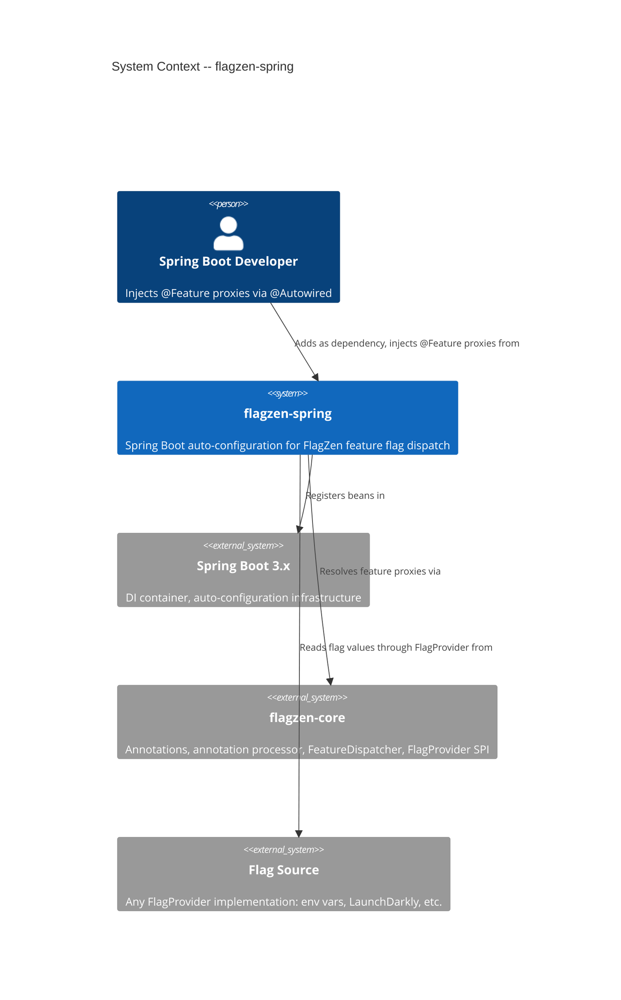
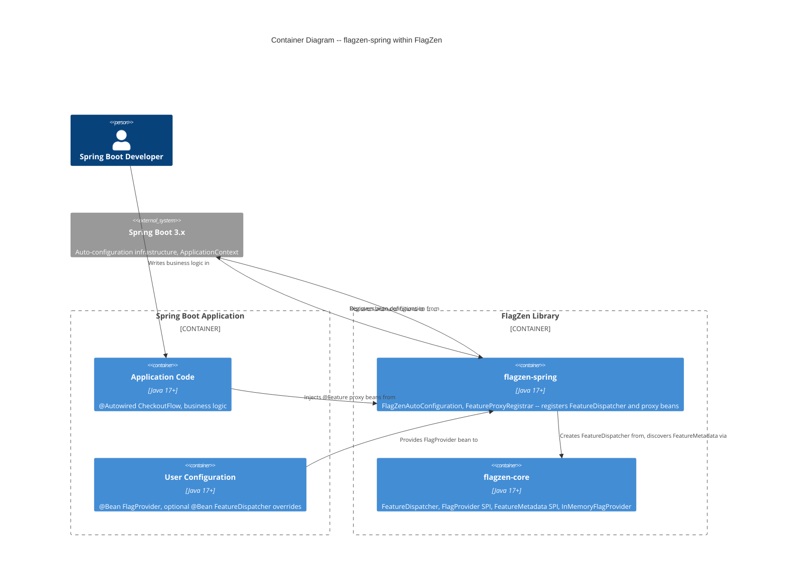
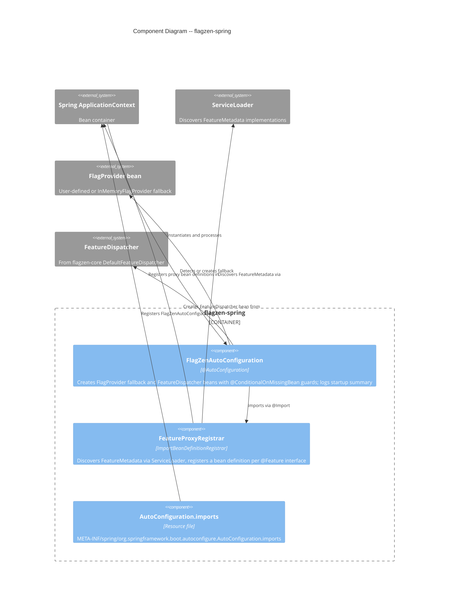

# Architecture Design -- flagzen-spring (M4: Spring Integration)

## 1. System Context

flagzen-spring is an **adapter module** in the FlagZen library. It bridges FlagZen's core dispatch mechanism with Spring Boot's dependency injection container. Its sole responsibility is auto-configuring FlagZen beans so that Spring developers can inject `@Feature` proxies via `@Autowired` with zero manual wiring.

### Capabilities

|             Capability             |                                             Description                                             |
| ---------------------------------- | --------------------------------------------------------------------------------------------------- |
| Auto-configure `FeatureDispatcher` | Detect `FlagProvider` bean from Spring `ApplicationContext`, create `FeatureDispatcher` singleton   |
| Register feature proxy beans       | Discover `FeatureMetadata` via `ServiceLoader`, register a bean definition per `@Feature` interface |
| Fallback provider                  | Create `InMemoryFlagProvider` with WARN log when no `FlagProvider` bean exists                      |
| Safe composition                   | `@ConditionalOnMissingBean` on all auto-configured beans, standard Spring back-off pattern          |
| Startup diagnostics                | INFO summary and DEBUG per-feature logging                                                          |

### Module Position in FlagZen Architecture

flagzen-spring is a **driving adapter** (primary port adapter). It adapts FlagZen's `FeatureDispatcher` and `FeatureMetadata` SPI to Spring Boot's bean lifecycle. It depends only on `flagzen-core` and `spring-boot-autoconfigure`. No other FlagZen module depends on it.

## 2. C4 System Context (Level 1)



## 3. C4 Container Diagram (Level 2)



## 4. C4 Component Diagram (Level 3) -- flagzen-spring Internals

flagzen-spring has exactly 3 internal components plus a registration resource, warranting an L3 diagram for clarity on the auto-configuration flow.



## 5. Auto-Configuration Flow

### Startup Sequence

1. Spring Boot discovers `FlagZenAutoConfiguration` via `META-INF/spring/org.springframework.boot.autoconfigure.AutoConfiguration.imports`
2. `FlagZenAutoConfiguration` processes:
   - **FlagProvider resolution**: If a `FlagProvider` bean exists in context, use it. If not, create `InMemoryFlagProvider` with WARN log (`@ConditionalOnMissingBean(FlagProvider.class)`)
   - **FeatureDispatcher creation**: Create `DefaultFeatureDispatcher` with the resolved `FlagProvider` (`@ConditionalOnMissingBean(FeatureDispatcher.class)`)
   - **Startup summary**: Log INFO with provider class name, feature count, feature names
3. `FeatureProxyRegistrar` (imported by `FlagZenAutoConfiguration` via `@Import`) processes:
   - Discovers all `FeatureMetadata` via `ServiceLoader`
   - For each metadata entry, registers a bean definition of the feature interface type
   - Bean definition uses a supplier that calls `FeatureDispatcher.resolve(featureType)` at bean creation time
   - Beans are singleton-scoped and lazy-initialized
4. Application code injects `@Feature` proxies via `@Autowired`

### Bean Dependency Graph

```
FlagProvider (user-defined or InMemoryFlagProvider fallback)
  |
  v
FeatureDispatcher (DefaultFeatureDispatcher, depends on FlagProvider)
  |
  v
Feature proxy beans (one per FeatureMetadata, resolved via FeatureDispatcher.resolve())
```

## 6. Proxy Bean Registration Strategy

See [ADR-019](../../../adrs/ADR-019-proxy-bean-registration-strategy.md) for the full decision record.

**Decision**: `ImportBeanDefinitionRegistrar` implemented by `FeatureProxyRegistrar`, imported via `@Import` from `FlagZenAutoConfiguration`.

**Rationale**: `ImportBeanDefinitionRegistrar` runs at bean definition registration time (before bean instantiation), allowing bean definitions to be registered with proper types visible to Spring's dependency injection. It integrates cleanly with `@AutoConfiguration` via `@Import` and respects auto-configuration conditional processing.

### Bean Definition Details

For each `FeatureMetadata<T>` discovered:

- **Bean name**: Lowercase simple name of the feature interface (e.g., `checkoutFlow` for `CheckoutFlow`)
- **Bean type**: The feature interface `Class<T>` from `FeatureMetadata.featureType()`
- **Bean scope**: Singleton (consistent with `FeatureDispatcher`'s proxy cache)
- **Lazy initialization**: Yes (avoids startup ordering issues between `FeatureDispatcher` and proxy beans)
- **Bean supplier**: Resolves the `FeatureDispatcher` bean from the `BeanFactory`, then calls `dispatcher.resolve(featureType)`

## 7. Technology Stack

|     Component      |        Technology         |  Version   |  License   |                              Rationale                               |
| ------------------ | ------------------------- | ---------- | ---------- | -------------------------------------------------------------------- |
| Auto-configuration | Spring Boot Autoconfigure | 3.x (3.2+) | Apache 2.0 | Standard Spring Boot starter mechanism, required for target audience |
| DI framework       | Spring Framework          | 6.x        | Apache 2.0 | Transitive via Spring Boot, provides `ImportBeanDefinitionRegistrar` |
| SPI discovery      | `java.util.ServiceLoader` | JDK 17+    | N/A        | Already used by flagzen-core, zero additional dependency             |
| Logging            | SLF4J (via Spring Boot)   | 2.x        | MIT        | Standard Spring Boot logging, no additional dependency               |
| Build              | Gradle                    | 8.x        | Apache 2.0 | Existing project build tool                                          |

**Dependencies for flagzen-spring `build.gradle.kts`**:

- `api("com.flagzen:flagzen-core")` -- transitive to consumers
- `implementation("org.springframework.boot:spring-boot-autoconfigure")` -- auto-configuration infrastructure
- `testImplementation("org.springframework.boot:spring-boot-starter-test")` -- integration testing

No proprietary dependencies. All OSS with permissive licenses.

## 8. Integration Patterns

### Auto-Configuration Discovery

- Registration file: `META-INF/spring/org.springframework.boot.autoconfigure.AutoConfiguration.imports`
- Content: single line `com.flagzen.spring.FlagZenAutoConfiguration`
- Spring Boot 3.x style (not deprecated `spring.factories`)

### FlagProvider Bean Detection

- Standard Spring DI: `FlagProvider` as a `@Bean` method parameter on `FeatureDispatcher` bean creation
- No FlagZen-specific resolution logic; `@Primary`, `@Qualifier`, `@Profile` all work via Spring
- Ambiguous beans fail with standard Spring `NoUniqueBeanDefinitionException`

### Auto-Configuration Ordering

- `@AutoConfigureAfter` is not required for v1.1.0 because no FlagZen provider module currently has auto-configuration
- When provider modules add auto-configuration in the future (e.g., `flagzen-env`), they should declare `@AutoConfigureBefore(FlagZenAutoConfiguration.class)` so their `FlagProvider` bean is available before flagzen-spring processes
- The lazy initialization of feature proxy beans also mitigates ordering concerns: `FeatureDispatcher` does not need to be fully wired until the first proxy bean is actually resolved

### External Integration Annotation

flagzen-spring integrates with **Spring Boot Autoconfigure** (external SDK):

```
External Integrations Requiring Contract Tests:
- Spring Boot Autoconfigure (Java API): auto-configuration lifecycle, @ConditionalOnMissingBean, ImportBeanDefinitionRegistrar
  Recommended: integration tests against Spring Boot version matrix in CI
  Risk: Spring Boot major version changes (3.x -> 4.x) may alter auto-configuration behavior
```

Note: This is a compile-time/framework API dependency, not a runtime service. Traditional consumer-driven contracts (Pact) do not apply. Version matrix testing in CI is the appropriate mitigation.

## 9. Quality Attribute Strategies

### Maintainability (PRIMARY)

- Single-responsibility: `FlagZenAutoConfiguration` for bean creation, `FeatureProxyRegistrar` for metadata-driven registration
- Zero coupling to any specific `FlagProvider` implementation
- Standard Spring Boot patterns that any Spring developer recognizes

### Testability (PRIMARY)

- `@SpringBootTest` with `@TestConfiguration` for override testing
- `ApplicationContextRunner` for lightweight auto-configuration tests without full context
- InMemoryFlagProvider fallback enables tests without external flag source

### Performance (SECONDARY)

- Lazy bean initialization for feature proxies avoids startup ordering issues
- `ServiceLoader` discovery is once-at-startup, results cached in bean definitions
- Proxy beans are singletons; dispatch is a map lookup per call (nanoseconds)

### Reliability (SECONDARY)

- `@ConditionalOnMissingBean` prevents bean conflicts
- `InMemoryFlagProvider` fallback ensures app always starts (no hard failure)
- WARN log for fallback makes misconfiguration visible without crashing

### Observability

- INFO startup summary: provider class, feature names, proxy count
- DEBUG per-feature registration logging
- Standard SLF4J through Spring Boot logging

## 10. Architectural Enforcement

|                           Rule                            |              Tool              |                                                 Enforcement                                                 |
| --------------------------------------------------------- | ------------------------------ | ----------------------------------------------------------------------------------------------------------- |
| flagzen-spring depends only on flagzen-core + Spring Boot | Gradle dependency constraints  | `build.gradle.kts` -- no cross-extension module dependencies                                                |
| No `java.lang.reflect` usage                              | ArchUnit                       | Same rule as core, applied to `com.flagzen.spring..`                                                        |
| Package structure: only `com.flagzen.spring`              | ArchUnit                       | `classes().that().resideInAPackage("com.flagzen.spring..").should().resideInAPackage("com.flagzen.spring")` |
| Auto-configuration conditional guards                     | Code review + integration test | Every `@Bean` method has `@ConditionalOnMissingBean`                                                        |

## 11. ADR Index

|                                 ADR                                  |              Title               |  Status  |
| -------------------------------------------------------------------- | -------------------------------- | -------- |
| [ADR-019](../../../adrs/ADR-019-proxy-bean-registration-strategy.md) | Proxy Bean Registration Strategy | Proposed |
