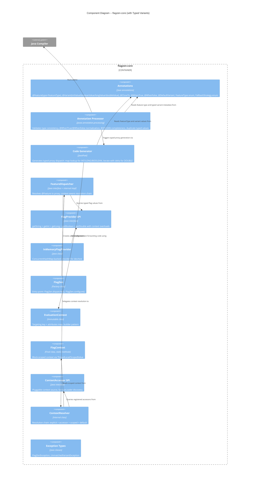

# Architecture Design -- Typed Variants (flagzen-typed-variants)

## 1. Overview

This document describes how typed polymorphic dispatch extends the existing flagzen-core architecture. It covers the `FeatureType` enum, typed `@Variant` attributes, `@CloseTo` for approximate double matching, `@WhenTrue`/`@WhenFalse` convenience annotations, typed `FlagProvider` methods, and typed proxy dispatch. All changes are within flagzen-core; no new modules are introduced.

### Scope

- `FeatureType` enum (STRING, INT, LONG, BOOLEAN, DOUBLE)
- `@Feature(type = FeatureType.X)` attribute
- `@Variant` typed attributes (intValue, booleanValue, longValue, doubleValue)
- `@CloseTo(value, delta)` annotation for approximate double matching
- `@WhenTrue`/`@WhenFalse` convenience annotations
- `FlagProvider` typed default methods (`getBoolean`, `getInt`, `getLong`, `getDouble`) with context-aware overloads
- Typed proxy dispatch (map lookup for INT/LONG/BOOLEAN, iterate with delta for DOUBLE)
- Compile-time type validation

### Relationship to Existing Architecture

This milestone extends flagzen-core only. The module dependency graph (M0 architecture-design.md Section 5) is unchanged. No new modules, no new external dependencies. All new types live in existing packages (`com.flagzen`, `com.flagzen.processor`). The `FlagProvider` SPI gains default methods -- no breaking changes to existing implementations.

### Relationship to ADR-008 (Unified Ordered Dispatch)

Typed variants participate in the unified ordered dispatch model. When a typed feature has `order` attributes, the proxy evaluates variants in order (first match wins). When no `order` is present:

- INT/LONG/BOOLEAN: O(1) map lookup (existing behavior pattern)
- DOUBLE: sequential iteration with delta matching (O(n), first match wins)

Typed variants and condition-based variants (M6) can coexist on the same feature via `order`, following ADR-008.

## 2. C4 System Context (Level 1) -- Unchanged

The system context diagram from the M0 architecture document remains valid. No new external actors or systems are introduced. Typed variants are an internal evolution of the annotation model and proxy generation.

## 3. C4 Container Diagram (Level 2) -- Unchanged

The module architecture is unchanged. All typed variant types are within flagzen-core. Provider adapter modules will optionally override typed `FlagProvider` methods in their own milestones, but that is a downstream concern.

## 4. C4 Component Diagram (Level 3) -- flagzen-core Updated

The L3 diagram adds the FeatureType enum and @CloseTo annotation to the annotations component, and reflects typed dispatch in the code generator.



## 5. Typed Dispatch Architecture

### Dispatch Strategy by FeatureType

| FeatureType | FlagProvider Method |          Proxy Map Type          |   Dispatch Strategy    | Complexity |
| ----------- | ------------------- | -------------------------------- | ---------------------- | ---------- |
| STRING      | `getString()`       | `Map<String, Supplier<T>>`       | Exact map lookup       | O(1)       |
| INT         | `getInt()`          | `Map<Integer, Supplier<T>>`      | Exact map lookup       | O(1)       |
| LONG        | `getLong()`         | `Map<Long, Supplier<T>>`         | Exact map lookup       | O(1)       |
| BOOLEAN     | `getBoolean()`      | `Map<Boolean, Supplier<T>>`      | Exact map lookup       | O(1)       |
| DOUBLE      | `getDouble()`       | List of (value, delta, supplier) | Iterate, delta compare | O(n)       |

### Dispatch Flow (Typed)

```
proxy.method(args)
  |
  v
resolveVariant()
  |
  v
context = FlagContext.current()
  |
  v
[STRING] flagProvider.getString(key [, ctx]) --> map.get(value)
[INT]    flagProvider.getInt(key [, ctx])    --> map.get(value)
[LONG]   flagProvider.getLong(key [, ctx])   --> map.get(value)
[BOOLEAN] flagProvider.getBoolean(key [, ctx]) --> map.get(value)
| [DOUBLE] flagProvider.getDouble(key [, ctx]) --> iterate: | flagValue - v.value | <= v.delta |
|                                                           |                     |            |
  v
match found? --> delegate to variant
no match? --> defaultVariant or fallback strategy
```

### DOUBLE Dispatch Detail

DOUBLE dispatch cannot use hash-based lookup because matching is approximate. The generated proxy:

1. Calls `flagProvider.getDouble(key)` or `flagProvider.getDouble(key, context)`
2. If present, iterates the variant list in declaration order (or `order` if specified)
3. For each variant: `Math.abs(flagValue - variant.value) <= variant.delta`
4. First match wins
5. If no match: default variant or fallback strategy

See ADR-013 for the delta strategy rationale.

### Ordered Dispatch Integration (ADR-008)

When a typed feature uses `order` attributes (mixing typed variants with conditions, or multiple DOUBLE variants):

- The proxy generates an ordered list of `(matcher, supplier)` pairs
- For typed variants, the matcher checks the typed value
- For condition variants (M6), the matcher evaluates the predicate
- Evaluation is sequential by `order`, first match wins
- `@DefaultVariant` is always last

When no `order` is present:

- INT/LONG/BOOLEAN: map lookup (no ordering needed -- values are unique by validation)
- DOUBLE: sequential iteration in declaration order (first match wins)

## 6. FlagProvider SPI Evolution

### New Default Methods

`FlagProvider` gains eight new default methods (four typed accessors, each with a context-aware overload). All parse from `getString()` for backward compatibility:

|                   Method                    |     Return Type     |                       Parse Behavior                        |
| ------------------------------------------- | ------------------- | ----------------------------------------------------------- |
| `getBoolean(String key)`                    | `Optional<Boolean>` | "true"/"false" case-insensitive; other strings return empty |
| `getBoolean(String key, EvaluationContext)` | `Optional<Boolean>` | Delegates to `getBoolean(key)` by default                   |
| `getInt(String key)`                        | `OptionalInt`       | `Integer.parseInt()`; parse failure returns empty           |
| `getInt(String key, EvaluationContext)`     | `OptionalInt`       | Delegates to `getInt(key)` by default                       |
| `getLong(String key)`                       | `OptionalLong`      | `Long.parseLong()`; overflow/parse failure returns empty    |
| `getLong(String key, EvaluationContext)`    | `OptionalLong`      | Delegates to `getLong(key)` by default                      |
| `getDouble(String key)`                     | `OptionalDouble`    | `Double.parseDouble()`; parse failure returns empty         |
| `getDouble(String key, EvaluationContext)`  | `OptionalDouble`    | Delegates to `getDouble(key)` by default                    |

### Backward Compatibility

- All methods are default methods -- existing `FlagProvider` implementations compile unchanged
- Default implementations parse from `getString()` -- providers that only implement `getString()` get typed accessors for free
- Context-aware overloads follow the same pattern as M1's `getString(key, context)`
- Providers that natively support typed values (e.g., LaunchDarkly, OpenFeature) override these methods in their adapter modules
- `getBoolean` parsing is stricter than `Boolean.parseBoolean()`: only "true"/"false" (case-insensitive) are valid. Other strings (e.g., "1", "yes", "maybe") return empty. This prevents silent misinterpretation.

### Conditional API

The same typed methods serve double duty:

1. **Proxy dispatch**: generated proxies call typed methods to get the dispatch key
2. **Conditional API**: developers call typed methods directly for simple if/else checks without polymorphic dispatch

This is a single set of methods, not two. US-M2-08 validates the conditional API use case.

## 7. Annotation Processor Evolution

### New Responsibilities

|             Responsibility             |                         Trigger                         |
| -------------------------------------- | ------------------------------------------------------- |
| Read `@Feature.type()` attribute       | Every `@Feature` annotation                             |
| Normalize `@WhenTrue`/`@WhenFalse`     | Annotations discovered in processing round              |
| Validate typed attribute matches type  | Every `@Variant` on a non-STRING feature                |
| Validate no mixed attributes           | Variants on same feature use consistent typed attribute |
| Validate BOOLEAN REQUIRED completeness | BOOLEAN feature with REQUIRED fallback                  |
| Validate duplicate typed values        | Two variants with same intValue/longValue/booleanValue  |
| Validate `@CloseTo` delta              | Every `@CloseTo` annotation (positive, finite)          |
| Populate FeatureModel with featureType | After reading `@Feature.type()`                         |
| Populate VariantModel with typed value | After reading typed `@Variant` attributes               |

### @WhenTrue/@WhenFalse Normalization

The processor discovers `@WhenTrue` and `@WhenFalse` annotations in the same processing round as `@Variant`. Before any validation:

1. Each `@WhenTrue` is converted to a VariantModel with `booleanValue = true`
2. Each `@WhenFalse` is converted to a VariantModel with `booleanValue = false`
3. The `of` attribute is carried through

After normalization, all validation and code generation operates on the unified VariantModel. See ADR-014.

### Error Messages

All compile-time error messages include:

- The feature name (flag key)
- The variant class name
- The expected attribute for the feature's type
- A suggested fix (e.g., "Use `@Variant(intValue = 3)` instead")

## 8. Generated Proxy Evolution

### Current (M0/M1)

Generated proxies hold `Map<String, Supplier<T>>` and call `flagProvider.getString(key)`. Context support (M1) passes `EvaluationContext` through `FlagContext.current()`.

### Updated (M2)

Generated proxies are type-aware:

| FeatureType |               Proxy Internal State               |     FlagProvider Call     |
| ----------- | ------------------------------------------------ | ------------------------- |
| STRING      | `Map<String, Supplier<T>>` (unchanged)           | `getString()` (unchanged) |
| INT         | `Map<Integer, Supplier<T>>`                      | `getInt()`                |
| LONG        | `Map<Long, Supplier<T>>`                         | `getLong()`               |
| BOOLEAN     | `Map<Boolean, Supplier<T>>`                      | `getBoolean()`            |
| DOUBLE      | List of `(double value, double delta, Supplier)` | `getDouble()`             |

### Proxy Class Shape -- Unchanged

|    Aspect    |                   Value                   |
| ------------ | ----------------------------------------- |
| Class name   | `{FeatureSimpleName}_FlagZenProxy`        |
| Package      | Same as @Feature interface                |
| Visibility   | Public class, package-private constructor |
| Implements   | The @Feature interface                    |
| Dependencies | `FlagProvider`, typed variant suppliers   |

The constructor signature changes: the variant map/list parameter type varies by FeatureType. The metadata factory method signature follows suit. This is internal to generated code -- not part of the public API.

### Proxy Dispatch per FeatureType

For STRING, the proxy method is unchanged from M0/M1.

For INT, LONG, BOOLEAN: the `resolveVariant()` method calls the typed `FlagProvider` method, gets the typed value, performs a map lookup with the typed key, and delegates. The fallback behavior (default variant, `FallbackStrategy`) is identical.

For DOUBLE: the `resolveVariant()` method calls `getDouble()`, iterates the variant list, checks each with `Math.abs(flagValue - v.value) <= v.delta`, and delegates to the first match. If no match, falls back.

## 9. FeatureMetadata Evolution

`FeatureMetadata` (generated per `@Feature`, SPI-discovered) evolves to carry `FeatureType`. The `createProxy` factory method signature changes to accept the typed variant data structure.

|                    Current createProxy Signature                     |                   Updated Concept                   |
| -------------------------------------------------------------------- | --------------------------------------------------- |
| `T createProxy(FlagProvider, Map<String, Supplier<T>>, Supplier<T>)` | Signature varies by FeatureType (typed map or list) |

Since `FeatureMetadata` is generated (not hand-written), this is a code generation change. The `FeatureMetadata` interface may need to become generic over the key type, or the factory method can accept `Object` and cast internally. The crafter decides the internal approach.

## 10. Thread Safety -- Unchanged

All new types follow existing thread safety patterns:

|       Component       |                           Strategy                            |
| --------------------- | ------------------------------------------------------------- |
| FeatureType enum      | Immutable enum. Thread-safe by design.                        |
| @CloseTo              | Annotation. No runtime state.                                 |
| @WhenTrue/@WhenFalse  | Annotations. No runtime state.                                |
| Typed proxy maps      | Immutable after construction. Thread-safe by design.          |
| FlagProvider defaults | Stateless default methods calling `getString()`. Thread-safe. |

## 11. Quality Attribute Impact

### Maintainability

- `FeatureType` enum centralizes type knowledge -- adding future types requires adding an enum constant and dispatch path
- `@WhenTrue`/`@WhenFalse` normalization means zero divergent processing paths
- Typed `FlagProvider` methods are default methods -- existing providers unchanged

### Testability

- Each `FeatureType` dispatch path is independently testable
- `InMemoryFlagProvider` stores strings; typed proxies parse via default methods (no mock provider needed)
- `@PinFlag` continues to specify string values; typed parsing happens transparently
- DOUBLE delta matching is deterministic and unit-testable

### Performance

- INT/LONG/BOOLEAN: same O(1) map lookup as STRING
- DOUBLE: O(n) iteration where n is variant count (typically 2-5, negligible)
- Default `FlagProvider` typed methods add one `getString()` call + one parse -- acceptable overhead
- Providers that natively support typed values eliminate the parse step

### Backward Compatibility

- `@Feature` without `type` defaults to STRING -- zero change for existing features
- `@Variant(value = "...")` continues to work for STRING features
- `FlagProvider.getString()` unchanged
- `InMemoryFlagProvider` unchanged
- All existing generated proxies work after recompilation

## 12. Story-to-Component Traceability

|  Story   |                                        Components Modified/Created                                         |
| -------- | ---------------------------------------------------------------------------------------------------------- |
| US-M2-01 | `FeatureType` (new), `@Feature` (modified -- `type` attribute), FeatureModel (modified)                    |
| US-M2-02 | `@Variant` (modified -- typed attributes), `@CloseTo` (new), VariantModel (modified)                       |
| US-M2-03 | `@WhenTrue` (new), `@WhenFalse` (new), FlagZenProcessor (modified -- normalization)                        |
| US-M2-04 | FlagZenProcessor (modified -- type validation, completeness, duplicates)                                   |
| US-M2-05 | FlagProvider (modified -- `getInt`/`getBoolean` default methods), ProxyGenerator (modified -- INT/BOOLEAN) |
| US-M2-06 | ProxyGenerator (verified -- typed dispatch uses existing M1 context flow)                                  |
| US-M2-07 | FlagProvider (modified -- `getLong`/`getDouble`), ProxyGenerator (modified -- LONG/DOUBLE)                 |
| US-M2-08 | FlagProvider (documented as conditional API -- same methods as US-M2-05/US-M2-07)                          |

## 13. ADR Index (This Milestone)

|   ADR   |                             Title                             |  Status  |
| ------- | ------------------------------------------------------------- | -------- |
| ADR-013 | @CloseTo Delta Strategy for Approximate Double Matching       | Accepted |
| ADR-014 | @WhenTrue/@WhenFalse as Annotation Sugar for Boolean Variants | Accepted |

## 14. Architectural Enforcement

Existing ArchUnit rules remain. Additional enforcement for this milestone:

|                         Rule                          |   Tool   |                               Enforcement                                |
| ----------------------------------------------------- | -------- | ------------------------------------------------------------------------ |
| No `java.lang.reflect` in `com.flagzen..` (unchanged) | ArchUnit | Existing rule covers new classes                                         |
| FeatureType enum is in `com.flagzen` package          | ArchUnit | Enum placement validation                                                |
| @CloseTo is in `com.flagzen` package                  | ArchUnit | Annotation placement validation                                          |
| @WhenTrue/@WhenFalse are in `com.flagzen` package     | ArchUnit | Annotation placement validation                                          |
| Generated proxies contain no reflection (unchanged)   | ArchUnit | Existing rule covers typed proxies                                       |
| FlagProvider typed methods are default (not abstract) | ArchUnit | Interface method validation (prevents breaking change to existing impls) |

## 15. External Integrations

No new external integrations in this milestone. Provider adapters (LaunchDarkly, OpenFeature, Togglz) will override typed `FlagProvider` methods in their respective milestones. Contract test recommendation from M0 remains applicable.

**Note for platform-architect**: When provider adapters add typed method overrides, consumer-driven contracts should cover the typed methods alongside `getString()`. E.g., LaunchDarkly adapter's `getBoolean()` override should have a contract test verifying behavior against the LaunchDarkly Java SDK.
