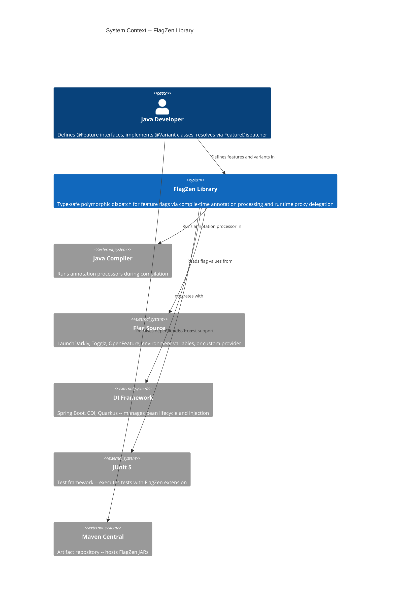
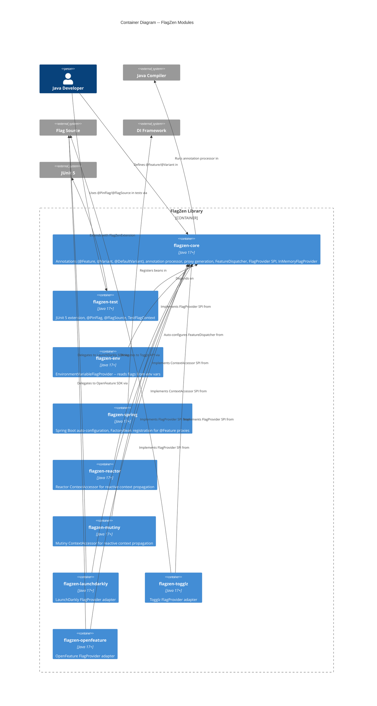
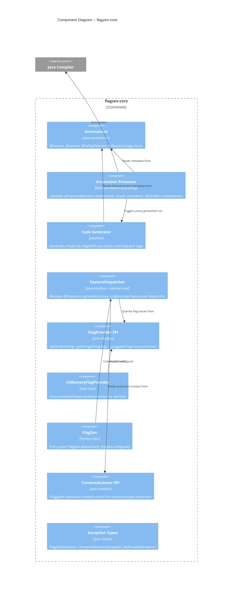

# Architecture Design -- FlagZen

## 1. System Context and Capabilities

FlagZen is a Java 17+ library that introduces polymorphic dispatch for feature flags. It replaces scattered if/else conditionals with type-safe interfaces, compile-time annotation processing, and runtime proxy delegation. It is **not** a service or platform -- it is a library consumed by Java applications.

### Core Capabilities

|          Capability          |                                         Description                                         |
| ---------------------------- | ------------------------------------------------------------------------------------------- |
| Type-safe feature definition | `@Feature` annotation on Java interfaces defines feature flags as types                     |
| Polymorphic dispatch         | Generated proxies delegate to the active `@Variant` implementation based on flag value      |
| Compile-time safety          | Annotation processor validates variant values, completeness, and type relationships         |
| Zero runtime reflection      | All dispatch code generated at compile time; runtime is map lookups and method calls        |
| Pluggable flag providers     | `FlagProvider` SPI abstracts flag value sources (env vars, LaunchDarkly, OpenFeature, etc.) |
| Testing DX                   | `@PinFlag`, `@FlagSource`, `TestFlagContext` for minimal test setup                         |
| DI integration               | Spring Boot auto-configuration, future CDI/Quarkus support                                  |

### Library vs. Service Framing

This architecture describes **module boundaries**, **dependency graph**, **SPI contracts**, and **annotation processor design**. There is no runtime infrastructure, deployment topology, or service mesh. The "system" is a set of JAR artifacts published to Maven Central, consumed by application developers.

## 2. C4 System Context (Level 1)



## 3. C4 Container Diagram (Level 2) -- Module Architecture

In library architecture, "containers" are Gradle submodules / published JAR artifacts.



## 4. C4 Component Diagram (Level 3) -- flagzen-core Internals

flagzen-core has 5+ internal components warranting an L3 diagram.



## 5. Module Dependency Graph

Dependencies flow inward toward flagzen-core. No module depends on another extension module.

```
flagzen-core (zero external dependencies)
  ^
  | --- flagzen-test (depends on: flagzen-core, junit-jupiter-api)                    |
  | --- flagzen-env (depends on: flagzen-core)                                        |
  | --- flagzen-spring (depends on: flagzen-core, spring-boot-autoconfigure)          |
  | --- flagzen-reactor (depends on: flagzen-core, reactor-core)                      |
  | --- flagzen-mutiny (depends on: flagzen-core, smallrye-mutiny)                    |
  | --- flagzen-launchdarkly (depends on: flagzen-core, launchdarkly-java-server-sdk) |
  | --- flagzen-togglz (depends on: flagzen-core, togglz-core)                        |
  | --- flagzen-openfeature (depends on: flagzen-core, openfeature-sdk)               |
```

**Critical constraint**: flagzen-core has ZERO external runtime dependencies. The annotation processor depends on the JDK `javax.annotation.processing` / `javax.lang.model` APIs only. JavaPoet is a compile-time-only dependency of the processor (not transitive to consumers).

## 6. Annotation Processor Architecture

### Processing Flow

1. Java compiler discovers `FlagZenProcessor` via `META-INF/services/javax.annotation.processing.Processor`
2. Processor receives `@Feature`-annotated interfaces and `@Variant`-annotated classes
3. **Validation phase**: check interface-only for @Feature, implements-relationship for @Variant, enum validation, duplicate detection, REQUIRED completeness
4. **Code generation phase**: for each @Feature, generate `{Feature}_FlagZenProxy` via JavaPoet
5. Generated sources written to standard annotation processor output directory

### Generated Proxy Structure

Each `{Feature}_FlagZenProxy`:

- Is a public class with package-private constructor (in same package as @Feature interface)
- Implements the @Feature interface
- Holds a reference to `FlagProvider` and a `Map<String, Supplier<FeatureInterface>>` of variant factories
- On each method call: queries `FlagProvider.getString(key)`, looks up variant in map, delegates
- Handles `FallbackStrategy` (EXCEPTION: throw, NOOP: return defaults, REQUIRED: N/A at runtime)
- Has `toString()` returning `"FlagZenProxy[{flag-key}]"`
- Contains zero `java.lang.reflect` imports

### Generated Proxy Discovery (FeatureMetadata)

The annotation processor generates a `{Feature}_FlagZenMetadata` class alongside each proxy. This metadata class implements a `FeatureMetadata` interface (in `com.flagzen.spi`) and is registered via `META-INF/services/com.flagzen.spi.FeatureMetadata`. The metadata provides:

- The `@Feature` interface class
- The proxy class
- A factory method to construct the proxy (accepting `FlagProvider` and variant instances)

This solves the cross-package instantiation problem: `FeatureDispatcher` discovers metadata via `ServiceLoader`, and the metadata's factory method constructs the proxy within the proxy's own package (where the package-private constructor is accessible).

### Incremental Annotation Processing

The annotation processor should be declared as an **isolating** processor where possible. Each `@Feature` interface generates its own proxy independently. However, cross-validation (duplicate variant detection across features) may require **aggregating** mode for the validation pass. The processor should support both modes:

- Isolating mode: proxy generation (one input -> one output)
- Aggregating mode: cross-feature validation (deferred to a final round)

Gradle's incremental annotation processing is supported when the processor declares its type via `META-INF/gradle/incremental.annotation.processors`.

### Cross-Module Variant Discovery

Within a single compilation unit, the annotation processor discovers all @Feature and @Variant types. Cross-module discovery (feature in module A, variant in module B) requires a runtime startup validation step, not compile-time. This is deferred to Release 2.

## 7. SPI Contracts

### FlagProvider SPI

```
Interface: com.flagzen.spi.FlagProvider
Method: Optional<String> getString(String key)
Discovery: java.util.ServiceLoader + META-INF/services/com.flagzen.spi.FlagProvider
```

Release 1 contract is string-only. Typed accessors (`getBoolean(String)`, `getInt(String)`) deferred to later release for the conditional API path.

### ContextAccessor SPI

```
Interface: com.flagzen.spi.ContextAccessor
Method: Optional<EvaluationContext> getContext()
Discovery: java.util.ServiceLoader + META-INF/services/com.flagzen.spi.ContextAccessor
```

Pluggable context source for reactive pipelines. Reactor and Mutiny modules implement this SPI.

## 8. Thread Safety Strategy

|      Component       |                                                        Strategy                                                         |
| -------------------- | ----------------------------------------------------------------------------------------------------------------------- |
| Generated proxies    | Immutable after construction. Flag resolution is stateless -- queries FlagProvider on each call. Thread-safe by design. |
| FeatureDispatcher    | Singleton proxies stored in `ConcurrentHashMap`. Thread-safe.                                                           |
| InMemoryFlagProvider | `ConcurrentHashMap<String, String>` backing store. Thread-safe.                                                         |
| FlagProvider SPI     | Implementations must be thread-safe (documented contract).                                                              |
| TestFlagContext      | Thread-local isolation per test. JUnit extension manages lifecycle.                                                     |

## 9. Package Structure

```
com.flagzen
  Feature.java                    (annotation)
  Variant.java                    (annotation, @Repeatable)
  DefaultVariant.java             (annotation)
  FallbackStrategy.java           (enum)
  FeatureDispatcher.java          (interface)
  FlagZen.java                    (factory/entry point)
  FlagZenException.java           (base exception)
  UnmatchedVariantException.java  (runtime exception)

com.flagzen.spi
  FlagProvider.java               (SPI interface)
  ContextAccessor.java            (SPI interface)

com.flagzen.internal
  DefaultFeatureDispatcher.java   (package-private implementation)
  InMemoryFlagProvider.java       (included in core for dev/test)

com.flagzen.processor
  FlagZenProcessor.java           (annotation processor)
  FeatureModel.java               (processor-internal model)
  VariantModel.java               (processor-internal model)
  ProxyGenerator.java             (code generation)

com.flagzen.test
  FlagZenExtension.java           (JUnit 5 extension)
  PinFlag.java                    (annotation)
  FlagSource.java                 (annotation)
  TestFlagContext.java             (programmatic test API)

com.flagzen.spring
  FlagZenAutoConfiguration.java   (Spring Boot auto-config)
  FeatureFactoryBean.java         (FactoryBean per @Feature)

com.flagzen.env
  EnvironmentVariableFlagProvider.java
```

## 10. Quality Attribute Strategies

### Maintainability (PRIMARY)

- Modular design: each concern is a separate Gradle submodule with clear single responsibility
- Dependency inversion: core defines SPIs, extensions implement them
- Zero coupling between extension modules
- Enforced module boundaries via Gradle dependency constraints

### Testability (PRIMARY)

- Core module has zero external dependencies -- unit tests need nothing but JUnit
- Generated proxies are concrete classes (not dynamic proxies) -- debuggable and inspectable
- `InMemoryFlagProvider` in core enables testing without any extension module
- `flagzen-test` provides first-class testing DX with `@PinFlag` and `TestFlagContext`

### Performance (SECONDARY)

- Zero runtime reflection -- all dispatch is compile-time generated code
- Flag resolution is a map lookup + method delegation (nanoseconds)
- No classpath scanning at startup
- Proxy construction once per feature per dispatcher (singleton)

### Reliability (SECONDARY)

- Compile-time validation catches most errors before runtime
- `FallbackStrategy` provides configurable runtime error handling
- Clear exception messages with actionable fix suggestions
- Thread-safe by design (immutable proxies, concurrent collections)

### Portability (SECONDARY)

- Java 17+ (no platform-specific dependencies)
- Gradle and Maven consumption supported (standard annotation processor discovery)
- SPI-based extensibility allows adaptation to any flag provider or DI framework

## 11. Integration Patterns

### Annotation Processor Discovery

- Standard `META-INF/services/javax.annotation.processing.Processor` auto-discovery
- No Gradle plugin required -- consumers add `annotationProcessor("com.flagzen:flagzen-core:$version")`
- Incremental annotation processing supported where possible

### FlagProvider SPI Discovery

- Primary: programmatic registration via `FlagZen.configure(config -> config.provider(myProvider))`
- Fallback: `java.util.ServiceLoader` discovery from classpath
- Priority: programmatic > ServiceLoader (explicit beats implicit)

### Spring Boot Integration

- Spring Boot auto-configuration via `META-INF/spring/org.springframework.boot.autoconfigure.AutoConfiguration.imports`
- `FlagZenAutoConfiguration` registers `FeatureDispatcher` as a Spring bean
- `FeatureFactoryBean` registered per discovered `@Feature` interface for `@Autowired` injection
- `FlagProvider` bean auto-detected from Spring `ApplicationContext`
- `@Variant` classes annotated with `@Component` participate in Spring DI

### Test Integration

- JUnit 5 extension registered via `@ExtendWith(FlagZenExtension.class)`
- Extension implements `BeforeEachCallback` (setup) and `AfterEachCallback` (teardown) for `@PinFlag`
- Extension implements `ParameterResolver` for `TestFlagContext` and `@Feature` interface injection
- Thread-local isolation enables parallel test execution

## 12. Architectural Enforcement

Recommended enforcement tooling:

|                        Rule                         |             Tool              |                                                           Enforcement                                                           |
| --------------------------------------------------- | ----------------------------- | ------------------------------------------------------------------------------------------------------------------------------- |
| No `java.lang.reflect` in flagzen-core runtime code | ArchUnit                      | Test: `noClasses().that().resideInAPackage("com.flagzen..").should().accessClassesThat().resideInAPackage("java.lang.reflect")` |
| Extension modules depend only on flagzen-core       | Gradle dependency constraints | `build.gradle.kts` -- no cross-extension dependencies                                                                           |
| Package structure compliance                        | ArchUnit                      | `classes().that().resideInAPackage("com.flagzen.internal..").should().notBePublic()`                                            |
| No circular dependencies                            | ArchUnit                      | `slices().matching("com.flagzen.(*)..").should().beFreeOfCycles()`                                                              |
| SPI implementations are thread-safe                 | Documentation + code review   | Documented in FlagProvider Javadoc                                                                                              |

## 13. External Integrations

External integrations are provider adapters that wrap third-party SDKs:

| Integration  |        Module        |           External SDK            |             Risk             |
| ------------ | -------------------- | --------------------------------- | ---------------------------- |
| LaunchDarkly | flagzen-launchdarkly | launchdarkly-java-server-sdk      | SDK API changes              |
| Togglz       | flagzen-togglz       | togglz-core                       | API changes                  |
| OpenFeature  | flagzen-openfeature  | openfeature-sdk (dev.openfeature) | CNCF project, API may evolve |
| Spring Boot  | flagzen-spring       | spring-boot-autoconfigure         | Major version changes        |
| JUnit 5      | flagzen-test         | junit-jupiter-api                 | Stable API, low risk         |

**Contract tests recommended for LaunchDarkly, Togglz, and OpenFeature APIs** -- consumer-driven contracts (e.g., Pact or Spring Cloud Contract) to detect breaking changes in provider SDKs before production. These are the highest-risk boundaries.

## 14. ADR Index

|                                 ADR                                  |              Title               |  Status  |
| -------------------------------------------------------------------- | -------------------------------- | -------- |
| [ADR-001](../../../adrs/ADR-001-proxy-generation-strategy.md)        | Proxy Generation Strategy        | Accepted |
| [ADR-002](../../../adrs/ADR-002-code-generation-tooling.md)          | Code Generation Tooling          | Accepted |
| [ADR-003](../../../adrs/ADR-003-flagprovider-contract.md)            | FlagProvider SPI Contract        | Accepted |
| [ADR-004](../../../adrs/ADR-004-feature-dispatcher-design.md)        | FeatureDispatcher Design         | Accepted |
| [ADR-005](../../../adrs/ADR-005-module-structure.md)                 | Module Structure                 | Accepted |
| [ADR-006](../../../adrs/ADR-006-annotation-retention-and-targets.md) | Annotation Retention and Targets | Accepted |
| [ADR-007](../../../adrs/ADR-007-generated-proxy-visibility.md)       | Generated Proxy Visibility       | Accepted |
